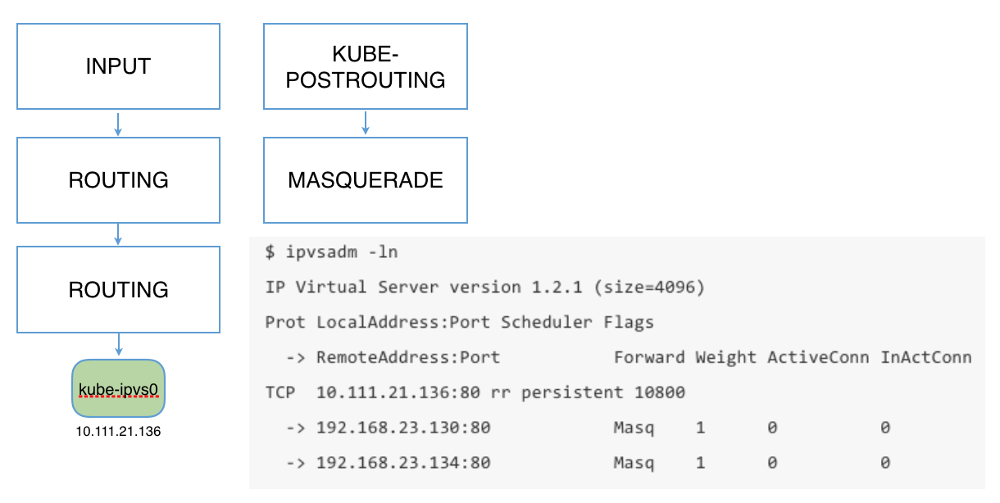

# kube-proxy via ipvs

> **歷史本地實驗，不適用於生產或 Kubernetes v1.37.1。** 本頁描述 Kubernetes v1.8 的 IPVS alpha 及手工 ipvsadm 規則。當前 kube-proxy IPVS 模式已棄用；nftables 模式已 GA，但不是預設模式。範例會啟動本地開發叢集、強制結束 kube-proxy，並手工修改主機網路；不要在當前或生產叢集執行。按 [Kubernetes v1.37 kube-proxy 文件](https://kubernetes.io/docs/reference/networking/virtual-ips/)設定當前服務代理模式。


Kubernetes v1.8已經支援ipvs負載平衡模式（alpha版），只需要設定kube-proxy `--proxy-mode=ipvs`即可啟用。



## ipvs範例

### NAT mode

```sh
# prepare local kubernetes cluster
$ sudo ./hack/local-up-cluster.sh
$ sudo kill -9 $KUBE_PROXY_PID

# run two nginx pods
$ kubectl run --image nginx --replicas=2 nginx

# expose deployment
$ kubectl expose deployment nginx --port=80 --target-port=80

$ kubectl get services
NAME         CLUSTER-IP   EXTERNAL-IP   PORT(S)   AGE
kubernetes   10.0.0.1     <none>        443/TCP   3m
nginx        10.0.0.185   <none>        80/TCP    4s

$ kubectl get pods -o wide
NAME                    READY     STATUS    RESTARTS   AGE       IP           NODE
nginx-348975970-7x18g   1/1       Running   0          49s       172.17.0.3   127.0.0.1
nginx-348975970-rtqrz   1/1       Running   0          49s       172.17.0.4   127.0.0.1

# Add dummy link
$ sudo ip link add type dummy
$ sudo ip addr add 10.0.0.185 dev dummy0

# Add ipvs rules; real server should use nat mode, since host is essentially
# the gateway.
$ sudo ipvsadm -A -t 10.0.0.185:80
$ sudo ipvsadm -a -t 10.0.0.185:80 -r 172.17.0.3:80 -m
$ sudo ipvsadm -a -t 10.0.0.185:80 -r 172.17.0.4:80 -m
$ sudo ipvsadm -Ln
IP Virtual Server version 1.2.1 (size=4096)
Prot LocalAddress:Port Scheduler Flags
  -> RemoteAddress:Port           Forward Weight ActiveConn InActConn
TCP  10.0.0.185:80 wlc
  -> 172.17.0.3:80                Masq    1      0          1
  -> 172.17.0.4:80                Masq    1      0          1

# Works in container
$ docker run -ti busybox wget -qO- 10.0.0.185:80
<!DOCTYPE html>
// truncated

# Works in host
$ curl 10.0.0.185:80
<!DOCTYPE html>
// truncated
```

### DR mode

```sh
# continue above setup;
$ PID=$(docker inspect -f '{{.State.Pid}}' k8s_nginx_nginx-348975970-rtqrz_default_b1661284-2eeb-11e7-924d-8825937fa049_0)
$ sudo mkdir -p /var/run/netns
$ sudo ln -s /proc/$PID/ns/net /var/run/netns/$PID
$ sudo ip link add type dummy
$ sudo ip link set dummy1 netns $PID
$ sudo ip netns exec $PID ip addr add 10.0.0.185 dev dummy1
$ sudo ip netns exec $PID ip link set dummy1 up
# same for the other pod
$ sudo ipvsadm -D -t 10.0.0.185:80
$ sudo ipvsadm -A -t 10.0.0.185:80
$ sudo ipvsadm -a -t 10.0.0.185:80 -r 172.17.0.3:80 -g
$ sudo ipvsadm -a -t 10.0.0.185:80 -r 172.17.0.4:80 -g
$ docker run -ti busybox wget -qO- 10.0.0.185:80
<!DOCTYPE html>
// truncated

// ignored seting arp_ignore/arp_announce
```
