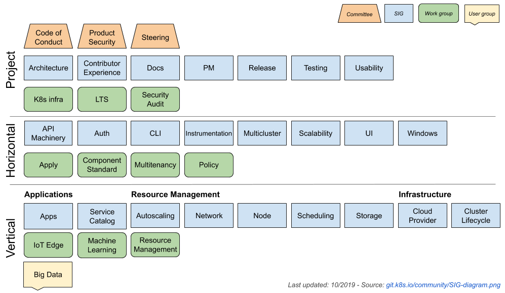

# 社区贡献

Kubernetes 支持以许多种方式来贡献社区，包括汇报代码缺陷、提交问题修复和功能实现、添加或修复文档、协助用户解决问题等等。

## 社区结构

Kubernetes 社区由三部分组成

* [Steering Committee](https://github.com/kubernetes/community/tree/master/committee-steering)
* [Special Interest Groups (SIGs)](https://github.com/kubernetes/community/blob/master/sig-list.md)
* Working Groups：请通过对应 SIG 的社区资料查找当前仍活跃的工作组

## 向 Kubernetes 主线贡献

修改 Kubernetes 代码、测试或文档时，应遵循 [Contributor Guide](https://www.kubernetes.dev/docs/) 与仓库的贡献说明。提交小而聚焦的 Pull Request，解释变更原因，遵循当前的代码/API/kubectl 约定，并在提交说明中报告适用的测试结果。测试目标及运行方式会随源码版本调整，参见[测试指南](testing.md)。

## 发布分支修复

发布分支修复和 cherry-pick 需遵循当前 Kubernetes Release SIG 流程、目标分支的贡献说明及发布经理审批要求。支持维护的分支列表和审批人会随时间变化；不要照搬旧示例中的 `release-1.7`、Hub 安装方式或旧 PR/Bot 流程。请查阅 [Kubernetes Release SIG](https://github.com/kubernetes/sig-release) 及当前发布周期的[发布经理信息](https://github.com/kubernetes/sig-release/blob/master/release-managers.md)。

## 参考文档

如果在社区贡献中碰到问题，可以参考以下指南

* [**Kubernetes Contributor Community**](https://kubernetes.io/community/)
* [**Kubernetes Contributor Guide**](https://github.com/kubernetes/community/tree/master/contributors/guide)
* [**Kubernetes Developer Guide**](https://github.com/kubernetes/community/tree/master/contributors/devel)
* [**Kubernetes Contributor Documentation**](https://www.kubernetes.dev/docs/)
* [Special Interest Groups](https://github.com/kubernetes/community)
* [Feature Tracking and Backlog](https://github.com/kubernetes/features)
* [Community Expectations](https://github.com/kubernetes/community/blob/master/contributors/guide/expectations.md)
* [Kubernetes release managers](https://github.com/kubernetes/sig-release/blob/master/release-managers.md)
