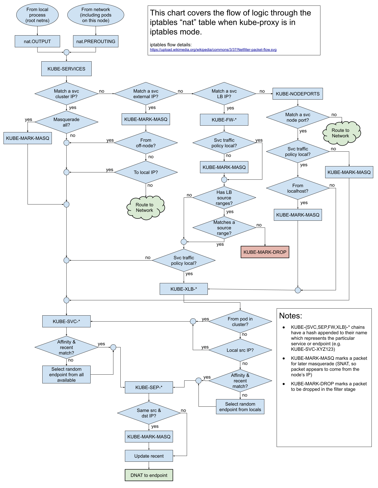

# kube-proxy

kube-proxy runs on cluster nodes and implements Service networking unless the cluster network provider supplies an alternative. Kubernetes v1.37 normally uses the iptables mode unless the cluster explicitly configures another mode.

Since v1.33, the legacy Endpoints API is deprecated. kube-proxy uses EndpointSlices to track Service backends; use EndpointSlices when diagnosing endpoint membership:

```bash
kubectl get endpointslices -l kubernetes.io/service-name=<service-name>
```

## Proxy modes

* `iptables`: supported and still the default mode.
* `nftables`: GA since v1.33. Use on supported Linux nodes with kernel 5.13 or newer after checking the cluster network provider's compatibility. It is not the default mode in v1.37.
* `ipvs`: deprecated since v1.35. Retain only when a cluster depends on it; plan migration to nftables or iptables.
* `winkernel`: Windows node proxy mode.

The `userspace` and `winuserspace` modes shown in old documents are historical, not current deployment choices.

旧版 IPVS 部署指南可能要求预加载 `ip_vs`、`ip_vs_rr`、`ip_vs_wrr`、`ip_vs_sh` 和 `nf_conntrack` 内核模块。IPVS 已弃用；不要把该设置用于 nftables 或 iptables 模式。请遵循发行版针对现存 IPVS 集群的迁移说明。

如需在 Linux 節點上使用 kube-proxy nftables 模式的背景與操作檢查，請參閱 [nftables 章節](../../network/nftables.md)；該模式不是 v1.37 的預設值。

## Iptables 示例（历史输出）
以下静态规则是历史示意，不是 Kubernetes v1.37 的默认规则清单。实际规则取决于代理模式、地址和 Service 配置。

### Kube-proxy iptables 示意图


\(图片来自[cilium/k8s-iptables-diagram](https://github.com/cilium/k8s-iptables-diagram)\)

### Kube-proxy NAT 示意图



（图片来自[kube-proxy iptables "nat" control flow](https://docs.google.com/drawings/d/1MtWL8qRTs6PlnJrW4dh8135_S9e2SaawT410bJuoBPk/edit)）

### Iptables 示例（历史输出）

```bash
# Masquerade
-A KUBE-MARK-DROP -j MARK --set-xmark 0x8000/0x8000
-A KUBE-MARK-MASQ -j MARK --set-xmark 0x4000/0x4000
-A KUBE-POSTROUTING -m comment --comment "kubernetes service traffic requiring SNAT" -m mark --mark 0x4000/0x4000 -j MASQUERADE

# clusterIP and publicIP
-A KUBE-SERVICES ! -s 10.244.0.0/16 -d 10.98.154.163/32 -p tcp -m comment --comment "default/nginx: cluster IP" -m tcp --dport 80 -j KUBE-MARK-MASQ
-A KUBE-SERVICES -d 10.98.154.163/32 -p tcp -m comment --comment "default/nginx: cluster IP" -m tcp --dport 80 -j KUBE-SVC-4N57TFCL4MD7ZTDA
-A KUBE-SERVICES -d 12.12.12.12/32 -p tcp -m comment --comment "default/nginx: loadbalancer IP" -m tcp --dport 80 -j KUBE-FW-4N57TFCL4MD7ZTDA

# Masq for publicIP
-A KUBE-FW-4N57TFCL4MD7ZTDA -m comment --comment "default/nginx: loadbalancer IP" -j KUBE-MARK-MASQ
-A KUBE-FW-4N57TFCL4MD7ZTDA -m comment --comment "default/nginx: loadbalancer IP" -j KUBE-SVC-4N57TFCL4MD7ZTDA
-A KUBE-FW-4N57TFCL4MD7ZTDA -m comment --comment "default/nginx: loadbalancer IP" -j KUBE-MARK-DROP

# Masq for nodePort
-A KUBE-NODEPORTS -p tcp -m comment --comment "default/nginx:" -m tcp --dport 30938 -j KUBE-MARK-MASQ
-A KUBE-NODEPORTS -p tcp -m comment --comment "default/nginx:" -m tcp --dport 30938 -j KUBE-SVC-4N57TFCL4MD7ZTDA

# load balance for each endpoints
-A KUBE-SVC-4N57TFCL4MD7ZTDA -m comment --comment "default/nginx:" -m statistic --mode random --probability 0.33332999982 -j KUBE-SEP-UXHBWR5XIMVGXW3H
-A KUBE-SVC-4N57TFCL4MD7ZTDA -m comment --comment "default/nginx:" -m statistic --mode random --probability 0.50000000000 -j KUBE-SEP-TOYRWPNILILHH3OR
-A KUBE-SVC-4N57TFCL4MD7ZTDA -m comment --comment "default/nginx:" -j KUBE-SEP-6QCC2MHJZP35QQAR

# endpoint #1
-A KUBE-SEP-6QCC2MHJZP35QQAR -s 10.244.3.4/32 -m comment --comment "default/nginx:" -j KUBE-MARK-MASQ
-A KUBE-SEP-6QCC2MHJZP35QQAR -p tcp -m comment --comment "default/nginx:" -m tcp -j DNAT --to-destination 10.244.3.4:80

# endpoint #2
-A KUBE-SEP-TOYRWPNILILHH3OR -s 10.244.2.4/32 -m comment --comment "default/nginx:" -j KUBE-MARK-MASQ
-A KUBE-SEP-TOYRWPNILILHH3OR -p tcp -m comment --comment "default/nginx:" -m tcp -j DNAT --to-destination 10.244.2.4:80

# endpoint #3
-A KUBE-SEP-UXHBWR5XIMVGXW3H -s 10.244.1.2/32 -m comment --comment "default/nginx:" -j KUBE-MARK-MASQ
-A KUBE-SEP-UXHBWR5XIMVGXW3H -p tcp -m comment --comment "default/nginx:" -m tcp -j DNAT --to-destination 10.244.1.2:80
```

如果服务设置了 `externalTrafficPolicy: Local` 并且当前 Node 上面没有任何属于该服务的 Pod，那么在 `KUBE-XLB-4N57TFCL4MD7ZTDA` 中会直接丢掉从公网 IP 请求的包：

```bash
-A KUBE-XLB-4N57TFCL4MD7ZTDA -m comment --comment "default/nginx: has no local endpoints" -j KUBE-MARK-DROP
```

## IPVS 示例（已弃用后端）
IPVS 自 Kubernetes v1.35 起已弃用。下方输出仅用于识别旧集群，不代表推荐的 v1.37 配置。

[Kube-proxy IPVS mode](https://github.com/kubernetes/kubernetes/blob/master/pkg/proxy/ipvs/README.md) 列出了各种服务在 IPVS 模式下的工作原理。


```bash
$ ipvsadm -ln
IP Virtual Server version 1.2.1 (size=4096)
Prot LocalAddress:Port Scheduler Flags
  -> RemoteAddress:Port           Forward Weight ActiveConn InActConn
TCP  10.0.0.1:443 rr persistent 10800
  -> 192.168.0.1:6443             Masq    1      1          0
TCP  10.0.0.10:53 rr
  -> 172.17.0.2:53                Masq    1      0          0
UDP  10.0.0.10:53 rr
  -> 172.17.0.2:53                Masq    1      0          0
```

注意，IPVS 模式也会使用 iptables 来执行 SNAT 和 IP 伪装（MASQUERADE），并使用 ipset 来简化 iptables 规则的管理：

| ipset 名 | 成员 | 用途 |
| :--- | :--- | :--- |
| KUBE-CLUSTER-IP | All service IP + port | Mark-Masq for cases that `masquerade-all=true` or `clusterCIDR` specified |
| KUBE-LOOP-BACK | All service IP + port + IP | masquerade for solving hairpin purpose |
| KUBE-EXTERNAL-IP | service external IP + port | masquerade for packages to external IPs |
| KUBE-LOAD-BALANCER | load balancer ingress IP + port | masquerade for packages to load balancer type service |
| KUBE-LOAD-BALANCER-LOCAL | LB ingress IP + port with `externalTrafficPolicy=local` | accept packages to load balancer with `externalTrafficPolicy=local` |
| KUBE-LOAD-BALANCER-FW | load balancer ingress IP + port with `loadBalancerSourceRanges` | package filter for load balancer with `loadBalancerSourceRanges` specified |
| KUBE-LOAD-BALANCER-SOURCE-CIDR | load balancer ingress IP + port + source CIDR | package filter for load balancer with `loadBalancerSourceRanges` specified |
| KUBE-NODE-PORT-TCP | nodeport type service TCP port | masquerade for packets to nodePort\(TCP\) |
| KUBE-NODE-PORT-LOCAL-TCP | nodeport type service TCP port with `externalTrafficPolicy=local` | accept packages to nodeport service with `externalTrafficPolicy=local` |
| KUBE-NODE-PORT-UDP | nodeport type service UDP port | masquerade for packets to nodePort\(UDP\) |
| KUBE-NODE-PORT-LOCAL-UDP | nodeport type service UDP port with`externalTrafficPolicy=local` | accept packages to nodeport service with`externalTrafficPolicy=local` |

## 配置 kube-proxy

选择代理模式时，先检查集群发行版、操作系统、内核版本和 CNI 实现的要求。Kubernetes v1.37 的 kubeadm 在未提供模式时明确选择 iptables，并会对 IPVS 发出弃用警告。不要仅通过修改 kube-proxy ConfigMap 就切换运行中的集群；按发行版文档规划配置变更和节点滚动更新。

```yaml
apiVersion: kubeproxy.config.k8s.io/v1alpha1
kind: KubeProxyConfiguration
mode: nftables
```

上面的配置片段只说明如何选择模式，不是可直接用于所有发行版的完整 kube-proxy 配置。具体配置文件位置和重启流程由集群部署方式决定。

iptables 规则和 IPVS 表的历史示例见下文。输出依赖所选代理模式和集群配置，只用于帮助理解数据包转发。排错时先读取当前规则，不要直接复制或删除示例规则。
