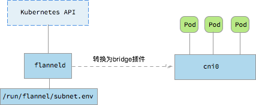

# Flannel

[Flannel](https://github.com/coreos/flannel)通过给每台宿主机分配一个子网的方式为容器提供虚拟网络，它基于Linux TUN/TAP，使用UDP封装IP包来创建overlay网络，并借助etcd维护网络的分配情况。

## 当前安装（2026-10-05）

Flannel v0.28.9 是本书查到的最新稳定发布版本。其官方发布说明未提供 Kubernetes v1.37 兼容矩阵，因此不要把此版本标为已验证支持 v1.37.1。安装前检查发行版、节点内核、CIDR 和 Flannel 发布说明。此清单部署一个主 CNI，不要与另一个不兼容的 CNI 并装。

如果集群使用示例中的 `10.244.0.0/16` Pod CIDR，创建集群时也必须使用同一范围；现有集群则先确认实际 Pod CIDR。清单使用 `apps/v1`、`rbac.authorization.k8s.io/v1`，并固定 Flannel 和 CNI 二进制镜像版本：

```bash
kubectl apply -f https://raw.githubusercontent.com/flannel-io/flannel/v0.28.9/Documentation/kube-flannel.yml
```

来源：[Flannel v0.28.9 发布](https://github.com/flannel-io/flannel/releases/tag/v0.28.9)、[版本化清单](https://raw.githubusercontent.com/flannel-io/flannel/v0.28.9/Documentation/kube-flannel.yml)。该发布的 Kubernetes v1.37 支持状态未在上游矩阵中确认。

## 历史原理与配置示例

> 以下 etcd、Docker 集成、CNI bridge 变换和旧 Kubernetes 部署输出用于讲解历史实现，不是上面的当前安装方法。旧的 `coreos/flannel` `master` 清单不可用。


## Flannel原理

控制平面上host本地的flanneld负责从远端的ETCD集群同步本地和其它host上的subnet信息，并为POD分配IP地址。数据平面flannel通过Backend（比如UDP封装）来实现L3 Overlay，既可以选择一般的TUN设备又可以选择VxLAN设备。

```javascript
{
    "Network": "10.0.0.0/8",
    "SubnetLen": 20,
    "SubnetMin": "10.10.0.0",
    "SubnetMax": "10.99.0.0",
    "Backend": {
        "Type": "udp",
        "Port": 7890
    }
}
```


除了UDP，Flannel还支持很多其他的Backend：

* udp：使用用户态udp封装，默认使用8285端口。由于是在用户态封装和解包，性能上有较大的损失
* vxlan：vxlan封装，需要配置VNI，Port（默认8472）和[GBP](https://github.com/torvalds/linux/commit/3511494ce2f3d3b77544c79b87511a4ddb61dc89)
* host-gw：直接路由的方式，将容器网络的路由信息直接更新到主机的路由表中，仅适用于二层直接可达的网络
* aws-vpc：使用 Amazon VPC route table 创建路由，适用于AWS上运行的容器
* gce：使用Google Compute Engine Network创建路由，所有instance需要开启IP forwarding，适用于GCE上运行的容器
* ali-vpc：使用阿里云VPC route table 创建路由，适用于阿里云上运行的容器

## Docker集成

```bash
source /run/flannel/subnet.env
docker daemon --bip=${FLANNEL_SUBNET} --mtu=${FLANNEL_MTU} &
```

## CNI集成

CNI flannel插件会将flannel网络配置转换为bridge插件配置，并调用bridge插件给容器netns配置网络。比如下面的flannel配置

```javascript
{
    "name": "mynet",
    "type": "flannel",
    "delegate": {
        "bridge": "mynet0",
        "mtu": 1400
    }
}
```

会被cni flannel插件转换为

```javascript
{
    "name": "mynet",
    "type": "bridge",
    "mtu": 1472,
    "ipMasq": false,
    "isGateway": true,
    "ipam": {
        "type": "host-local",
        "subnet": "10.1.17.0/24"
    }
}
```

## 历史 Kubernetes 集成输出

> 旧教程使用 `coreos/flannel` 的 `master` 清单，且没有固定 Flannel 镜像版本。清单部署命令已移除；该旧输出只作原理参考。当前安装请使用本页上方固定版本的 Flannel v0.28.9 清单。
以下仅保留旧安装产生的进程与 CNI 配置样例，用于阅读历史日志：

```bash
$ ps -ef | grep flannel | grep -v grep
root      3625  3610  0 13:57 ?        00:00:00 /opt/bin/flanneld --ip-masq --kube-subnet-mgr
root      9640  9619  0 13:51 ?        00:00:00 /bin/sh -c set -e -x; cp -f /etc/kube-flannel/cni-conf.json /etc/cni/net.d/10-flannel.conf; while true; do sleep 3600; done

$ cat /etc/cni/net.d/10-flannel.conf
{
  "name": "cbr0",
  "type": "flannel",
  "delegate": {
    "isDefaultGateway": true
  }
}
```



flanneld自动连接kubernetes API，根据`node.Spec.PodCIDR`配置本地的flannel网络子网，并为容器创建vxlan和相关的子网路由。

```bash
$ cat /run/flannel/subnet.env
FLANNEL_NETWORK=10.244.0.0/16
FLANNEL_SUBNET=10.244.0.1/24
FLANNEL_MTU=1410
FLANNEL_IPMASQ=true

$ ip -d link show flannel.1
12: flannel.1: <BROADCAST,MULTICAST,UP,LOWER_UP> mtu 1410 qdisc noqueue state UNKNOWN mode DEFAULT group default
    link/ether 8e:5a:0d:07:0f:0d brd ff:ff:ff:ff:ff:ff promiscuity 0
    vxlan id 1 local 10.146.0.2 dev ens4 srcport 0 0 dstport 8472 nolearning ageing 300 udpcsum addrgenmode eui64
```


## 优点

* 配置安装简单，使用方便
* 与云平台集成较好，VPC的方式没有额外的性能损失

## 缺点

* VXLAN模式对zero-downtime restarts支持不好

> When running with a backend other than udp, the kernel is providing the data path with flanneld acting as the control plane. As such, flanneld can be restarted \(even to do an upgrade\) without disturbing existing flows. However in the case of vxlan backend, this needs to be done within a few seconds as ARP entries can start to timeout requiring the flannel daemon to refresh them. Also, to avoid interruptions during restart, the configuration must not be changed \(e.g. VNI, --iface values\).

**参考文档**

* [https://github.com/coreos/flannel](https://github.com/coreos/flannel)
* [https://coreos.com/flannel/docs/latest/](https://coreos.com/flannel/docs/latest/)

