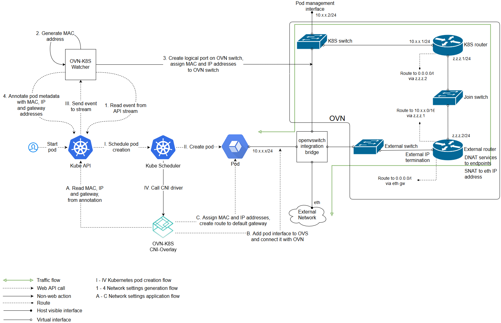

# OVN

> **版本与兼容性（2026-10-05）。** OVN-Kubernetes 最新稳定发布为 [v1.4.0](https://github.com/ovn-kubernetes/ovn-kubernetes/releases/tag/v1.4.0)（2026-09-04）；其发布说明提到 Kubernetes v1.36.2，但没有验证 v1.37.1 的兼容性声明。以下 `ovnkube` 直接进程和发行版包命令是旧式集成示例，不适用于当前集群；请按固定版本的上游发布说明选择部署方式。


[ovn-kubernetes](https://github.com/openvswitch/ovn-kubernetes) 提供了一个ovs OVN 网络插件，支持 underlay 和 overlay 两种模式。

* underlay：容器运行在虚拟机中，而ovs则运行在虚拟机所在的物理机上，OVN将容器网络和虚拟机网络连接在一起
* overlay：OVN通过logical overlay network连接所有节点的容器，此时ovs可以直接运行在物理机或虚拟机上

## 历史 overlay 进程示例（非 v1.37 部署指南）



### 历史 master 启动参数示例（不可直接执行）

```bash
# start ovn
/usr/share/openvswitch/scripts/ovn-ctl start_northd
/usr/share/openvswitch/scripts/ovn-ctl start_controller

# start ovnkube
nohup sudo ovnkube -k8s-kubeconfig kubeconfig.yaml -net-controller \
 -loglevel=4 \
 -k8s-apiserver="http://$CENTRAL_IP:8080" \
 -logfile="/var/log/openvswitch/ovnkube.log" \
 -init-master=$NODE_NAME -cluster-subnet="$CLUSTER_IP_SUBNET" \
 -service-cluster-ip-range=$SERVICE_IP_SUBNET \
 -nodeport \
 -nb-address="tcp://$CENTRAL_IP:6631" \
 -sb-address="tcp://$CENTRAL_IP:6632" 2>&1 &
```

### 历史 Node 启动参数示例（不可直接执行）

```bash
nohup sudo ovnkube -k8s-kubeconfig kubeconfig.yaml -loglevel=4 \
    -logfile="/var/log/openvswitch/ovnkube.log" \
    -k8s-apiserver="http://$CENTRAL_IP:8080" \
    -init-node="$NODE_NAME"  \
    -nodeport \
    -nb-address="tcp://$CENTRAL_IP:6631" \
    -sb-address="tcp://$CENTRAL_IP:6632" -k8s-token="$TOKEN" \
    -init-gateways \
    -service-cluster-ip-range=$SERVICE_IP_SUBNET \
    -cluster-subnet=$CLUSTER_IP_SUBNET 2>&1 &
```

### CNI插件原理

#### ADD操作

* 从`ovn` annotation获取ip/mac/gateway
* 在容器netns中配置接口和路由
* 添加ovs端口

```bash
ovs-vsctl add-port br-int veth_outside \
  --set interface veth_outside \
    external_ids:attached_mac=mac_address \
    external_ids:iface-id=namespace_pod \
    external_ids:ip_address=ip_address
```

#### DEL操作

```bash
ovs-vsctl del-port br-int port
```

## 历史安装步骤（已移除）

旧步骤依赖发行版仓库中的未固定版本 Open vSwitch/OVN 软件包、旧 apt keyrings 和全局 pip 安装；它不构成受支持的 OVN-Kubernetes v1.4.0 安装流程，不能用于 Kubernetes v1.37.1。

## 参考文档

* [https://github.com/openvswitch/ovn-kubernetes](https://github.com/openvswitch/ovn-kubernetes)

