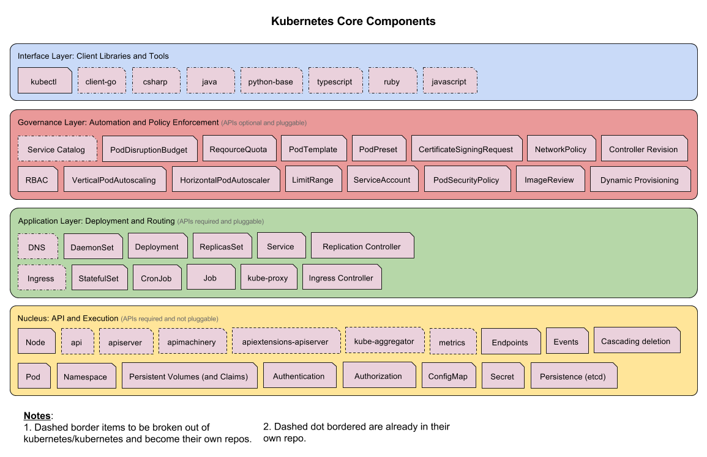

# 架構原理

Kubernetes 最初源於谷歌內部的 Borg，提供了面向應用的容器叢集部署和管理系統。Kubernetes 的目標旨在消除編排物理 / 虛擬計算，網路和儲存基礎設施的負擔，並使應用程式運營商和開發人員完全將重點放在以容器為中心的原語上進行自助運營。Kubernetes 也提供穩定、相容的基礎（平台），用於建置定製化的 workflows 和更高階的自動化任務。 Kubernetes 具備完善的叢集管理能力，包括多層次的安全防護和准入機制、多租戶應用支撐能力、透明的服務註冊和服務發現機制、內建負載平衡器、故障發現和自我修復能力、服務滾動升級和線上擴容、可擴充套件的資源自動排程機制、多粒度的資源配額管理能力。 Kubernetes 還提供完善的管理工具，涵蓋開發、部署測試、運維監控等各個環節。

## Borg 簡介

Borg 是谷歌內部的大規模叢集管理系統，負責對谷歌內部很多核心服務的排程和管理。Borg 的目的是讓使用者能夠不必操心資源管理的問題，讓他們專注於自己的核心業務，並且做到跨多個資料中心的資源利用率最大化。

Borg 主要由 BorgMaster、Borglet、borgcfg 和 Scheduler 組成，如下圖所示

* BorgMaster 是整個叢集的大腦，負責維護整個叢集的狀態，並將資料持久化到 Paxos 儲存中；
* Scheduer 負責任務的排程，根據應用的特點將其排程到具體的機器上去；
* Borglet 負責真正執行任務（在容器中）；
* borgcfg 是 Borg 的命令列工具，用於跟 Borg 系統互動，一般透過一個設定檔案來提交任務。

## Kubernetes 架構

Kubernetes 借鑑了 Borg 的設計理念，比如 Pod、Service、Labels 和單 Pod 單 IP 等。Kubernetes 的整體架構跟 Borg 非常像，如下圖所示

Kubernetes 的核心元件透過 API Server 協作：

* etcd 儲存叢集狀態。
* kube-apiserver 提供 Kubernetes API，並負責認證、授權、准入控制和 API 發現。
* kube-controller-manager 執行內建控制器；kube-scheduler 為尚未排程的 Pod 選擇節點。
* kubelet 在節點上管理 Pod 生命週期，並透過 CRI 呼叫容器執行時。Kubernetes v1.24 移除了內建 dockershim；Docker Engine 需要叢集發行版提供的外部 CRI 配接器（例如 cri-dockerd），不能直接作為 kubelet 的 CRI 執行時。
* CNI 外掛提供 Pod 網路，CSI 驅動提供持久卷。它們由叢集部署方案或管理員選擇。
* kube-proxy 為 Service 實現網路轉發。部分網路實現會替代 kube-proxy。

Kubernetes 不規定所有叢集都使用同一套附加元件。常見的叢集 DNS 實現是 CoreDNS；metrics-server 或其他符合 Metrics API 的服務由叢集部署方案另行提供。Heapster 和 Kubernetes Federation 均已退役。Pod 安全策略使用內建的 Pod Security Admission 或經評估的第三方准入方案，不再使用 PodSecurityPolicy。

### 分層架構

Kubernetes 設計理念和功能其實就是一個類似 Linux 的分層架構，如下圖所示

* 核心層：Kubernetes 最核心的功能，對外提供 API 建置高層的應用，對內提供外掛式應用執行環境
* 應用層：部署（無狀態應用、有狀態應用、批處理任務、叢集應用等）和路由（服務發現、DNS 解析等）
* 管理層：系統度量、自動化（如自動擴充套件和動態 Provision）以及策略管理（RBAC、Quota、Pod Security Admission、NetworkPolicy 等）
* 介面層：kubectl 命令列工具、客戶端 SDK 以及叢集外部提供的多叢集管理工具
* 生態系統：在介面層之上的龐大容器叢集管理排程的生態系統，可以劃分為兩個範疇
  * Kubernetes 外部：日誌、監控、設定管理、CI、CD、Workflow、FaaS、OTS 應用、ChatOps 等
  * Kubernetes 內部：CRI、CNI、CVI、映像檔登錄站、Cloud Provider、叢集自身的設定和管理等

### 核心元件

### 核心 API

### 生態系統

關於分層架構，可以關注下 Kubernetes 社群正在推進的 [Kubernetes architectural roadmap](https://github.com/kubernetes/community/tree/master/sig-architecture)。

## 參考文件

* [Kubernetes design and architecture](https://github.com/kubernetes/community/blob/master/contributors/design-proposals/architecture/architecture.md)
* [http://queue.acm.org/detail.cfm?id=2898444](http://queue.acm.org/detail.cfm?id=2898444)
* [http://static.googleusercontent.com/media/research.google.com/zh-CN//pubs/archive/43438.pdf](http://static.googleusercontent.com/media/research.google.com/zh-CN//pubs/archive/43438.pdf)
* [http://thenewstack.io/kubernetes-an-overview](http://thenewstack.io/kubernetes-an-overview)
* [Kubernetes Architecture SIG](https://github.com/kubernetes/community/tree/master/sig-architecture)
