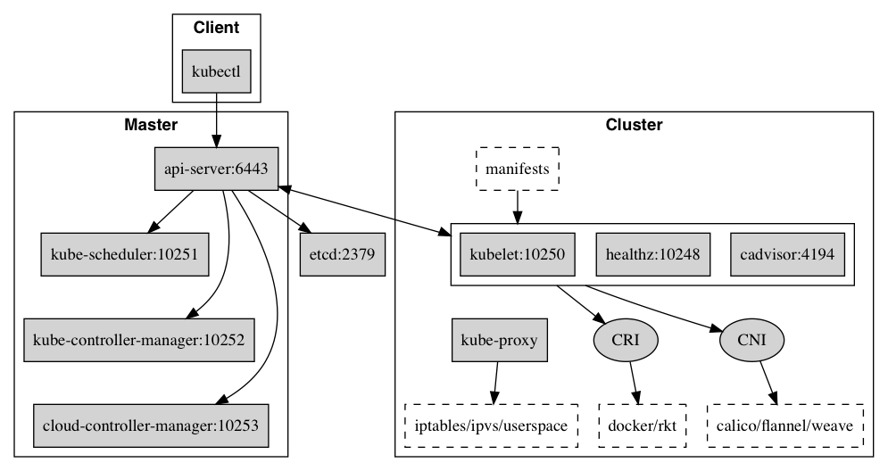

# 核心元件

Kubernetes 叢集通常包含以下控制平面和節點元件：

* etcd 儲存叢集狀態。
* API Server 提供資源 API，並執行認證、授權和准入控制。
* Controller Manager 執行控制器，維護資源的期望狀態。
* Scheduler 為尚未排程的 Pod 選擇節點。
* Kubelet 在節點上管理 Pod 生命週期，並透過 CRI 與容器執行時通訊。
* CNI 外掛提供 Pod 網路，CSI 驅動提供持久卷。
* kube-proxy 為 Service 設定網路轉發；部分網路實現會替代 kube-proxy。

## 元件通訊

Kubernetes 多元件之間的通訊原理為

* API Server 負責 etcd 儲存的所有操作，且只有 API Server 才直接操作 etcd 叢集
* API Server 對內（叢集中的其他元件）和對外（使用者）提供統一的 REST API，其他元件均透過 API Server 進行通訊
  * Controller Manager、Scheduler、Kube-proxy 和 Kubelet 等均透過 API Server watch API 監測資源變化情況，並對資源作相應的操作
  * 所有需要更新資源狀態的操作均透過 API Server 的 REST API 進行
* API Server 在日誌、exec、attach 等操作中會透過 HTTPS 連線 Kubelet。應保護 kubelet API 網路存取，並按叢集安全文件設定客戶端憑證與服務端證書信任；若未設定 `--kubelet-certificate-authority`，API Server 不會驗證 Kubelet serving certificate。不要依賴舊版 SSH 隧道部署的說明。

比如典型的建立 Pod 的流程為

1. 使用者透過 REST API 建立一個 Pod
2. API Server 將其寫入 etcd
3. Scheduluer 檢測到未綁定 Node 的 Pod，開始排程並更新 Pod 的 Node 綁定
4. Kubelet 檢測到有新的 Pod 排程過來，透過 Container Runtime 執行該 Pod
5. Kubelet 透過 Container Runtime 取到 Pod 狀態，並更新到 API Server 中

## 連接埠號

### Control plane node(s)

| Protocol | Direction | Port Range | Purpose |
| :--- | :--- | :--- | :--- |
| TCP | Inbound | 6443 | Kubernetes API server |
| TCP | Inbound | 2379-2380 | etcd client API，僅允許 API Server 與 etcd 成員存取 |
| TCP | Inbound | 10250 | Kubelet HTTPS API，限制為所需控制平面和節點通訊 |
| TCP | Inbound | 10257 | kube-controller-manager secure port |
| TCP | Inbound | 10259 | kube-scheduler secure port |

### Worker node(s)

| Protocol | Direction | Port Range | Purpose |
| :--- | :--- | :--- | :--- |
| TCP | Inbound | 10250 | Kubelet HTTPS API，限制為所需控制平面和節點通訊 |
| TCP/UDP | Inbound | 30000-32767 | NodePort Services 的預設連接埠範圍 |

連接埠清單以 Kubernetes [Ports and Protocols](https://kubernetes.io/docs/reference/networking/ports-and-protocols/) 為準。不要開放舊版的不安全 API、kubelet 只讀連接埠 10255 或 cAdvisor 連接埠 4194。實際監聽位址和連接埠可由元件設定或叢集發行版更改。預設只允許叢集拓撲實際需要的流量。

## 版本相容策略

Kubernetes v1.37 的元件版本必須遵守[官方版本偏差策略](https://kubernetes.io/releases/version-skew-policy/)：

* 高可用叢集中的 kube-apiserver 例項最多相差一個次要版本。
* kubelet 和 kube-proxy 不得比其通訊的 kube-apiserver 新，最多可比 API Server 舊三個次要版本。kube-proxy 與同一節點上的 kubelet 允許相差三個次要版本。
* kube-controller-manager、kube-scheduler 和 cloud-controller-manager 不得比其通訊的 API Server 新，通常與其版本相同；升級期間最多舊一個次要版本。
* kubectl 可以比 API Server 新或舊一個次要版本。高可用 API Server 存在版本差異時，按所有例項計算相容範圍。

從 v1.36 升級到 v1.37 時，先升級 API Server，再升級 controller manager、scheduler 和 cloud controller manager。確認 API Server 到達目標版本後，再逐節點升級 kubelet 和 kube-proxy。節點小版本升級前按發行版的操作流程安全遷移工作負載。

## 參考文件

* [Control plane 與 Node 通訊](https://kubernetes.io/docs/concepts/architecture/control-plane-node-communication/)
* [Kubernetes 架構](https://kubernetes.io/docs/concepts/architecture/)
* [Kubernetes 網路連接埠](https://kubernetes.io/docs/reference/networking/ports-and-protocols/)
* [Kubelet TLS 啟動引導與證書輪換](https://kubernetes.io/docs/tasks/tls/certificate-rotation/)
