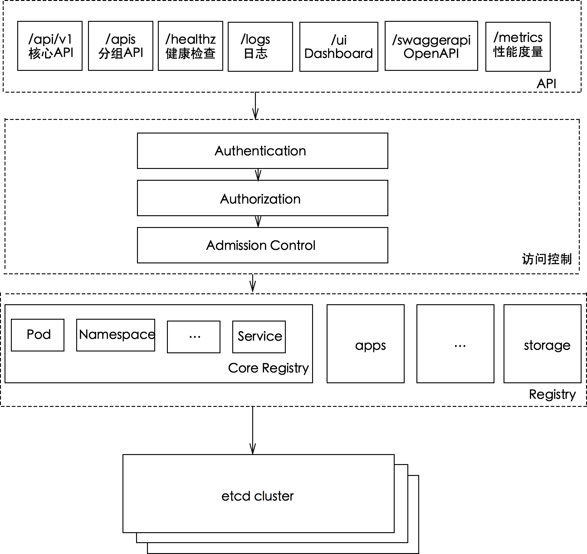

# kube-apiserver

kube-apiserver 是 Kubernetes 最重要的核心元件之一，主要提供以下功能：

* 提供叢集管理的 REST API 介面，包括驗證與授權、資料驗證以及叢集狀態變更等
* 提供其他模組之間資料交換與通訊的樞紐（其他模組透過 API Server 查詢或修改資料，只有 API Server 才會直接操作 etcd）

## REST API

kube-apiserver 透過 HTTPS 提供 Kubernetes API。預設的安全連接埠為 6443。已棄用的非安全 HTTP 連接埠預設不會啟用，且不得對外開放。呼叫 API 時，請使用叢集經過驗證的 kubeconfig。


（圖片來自 [OpenShift Blog](https://blog.openshift.com/kubernetes-deep-dive-api-server-part-1/)）

在實際使用中，通常透過 [kubectl](https://kubernetes.io/docs/user-guide/kubectl-overview/) 存取 apiserver，也可以透過 Kubernetes 各種語言的用戶端程式庫存取 apiserver。使用 kubectl 時，開啟偵錯記錄也可以查看每個 API 呼叫的格式，例如：

```bash
$ kubectl --v=8 get pods
```

可透過 `kubectl api-versions` 和 `kubectl api-resources` 查詢 Kubernetes API 支援的 API 版本以及資源物件。

## API 探索與 OpenAPI

啟用的 API 和擴充元件取決於叢集設定。請使用命令查詢目前的 API，不要將某個叢集匯出的 API 版本清單視為其他叢集的預設值：

```bash
kubectl api-versions
kubectl api-resources
kubectl api-resources --api-group=storage.k8s.io
kubectl explain deployment.spec
```

kube-apiserver 提供 OpenAPI v3 文件，入口為 `/openapi/v3`。產生用戶端程式碼時，請遵循 Kubernetes 用戶端產生器目前文件中的流程，並使用指定的目標分支。

## 存取控制

Kubernetes API 的每個要求都必須經過多階段的存取控制才會獲得接受，包括驗證、授權以及准入控制（Admission Control）等。


### 驗證

啟用 TLS 時，所有要求都必須先經過驗證。Kubernetes 支援多種驗證機制，並支援同時啟用多個驗證外掛程式（只要其中一個驗證通過即可）。驗證成功後，使用者的 `username` 會傳入授權模組，進行進一步的授權驗證；驗證失敗的要求則會收到 HTTP 401。

> **Kubernetes 不會直接管理使用者**
>
> 雖然 Kubernetes 驗證和授權會用到 username，但 Kubernetes 並不會直接管理使用者，無法建立 `user` 物件，也不會儲存 username。

如需進一步了解驗證模組的使用方式，請參閱 [Kubernetes 驗證外掛程式](../../extension/auth/#%20认证)。

### 授權

要求通過驗證後，便會進入授權模組。與驗證類似，Kubernetes 也支援多種授權機制，並支援同時啟用多個授權外掛程式（只要其中一個驗證通過即可）。授權成功後，使用者的要求會傳送至准入控制模組，以進行進一步的要求驗證；授權失敗的要求則會收到 HTTP 403。

如需進一步了解授權模組的使用方式，請參閱 [Kubernetes 授權外掛程式](../../extension/auth/#%20授权)。

### 准入控制

准入控制（Admission Control）用於進一步驗證要求或加入預設參數。不同於只關注要求使用者和操作的授權與驗證，准入控制也會處理要求的內容，而且只適用於建立、更新、刪除或連線（例如代理）等操作，讀取操作則不適用。准入控制也支援同時啟用多個外掛程式，並依序呼叫；只有通過所有外掛程式的要求，才能進入系統。

如需進一步了解准入控制模組的使用方式，請參閱 [Kubernetes 准入控制](../../extension/auth/admission.md)。

## 部署說明

kube-apiserver 的參數取決於叢集部署方式、憑證以及驗證與授權設定。請依據叢集發行版或 kubeadm 目前的文件設定控制平面，不要複製舊版本中的 `--insecure-port`、`--admission-control`、`--experimental-bootstrap-token-auth` 或 `--storage-backend` 參數。

## 運作原理

kube-apiserver 提供 Kubernetes 的 REST API，實作驗證、授權、准入控制等安全檢查功能，同時也負責叢集狀態的儲存操作（透過 etcd）。



### 串流式清單回應

Kubernetes v1.33 為協商使用 JSON 或 Protobuf 的 List 回應新增逐項編碼，降低大型資源集合回應所需的記憶體。v1.37 移除了 `StreamingCollectionEncodingToJSON` 和 `StreamingCollectionEncodingToProtobuf` 相關的 GA 功能閘門；請勿設定這些閘門。具體行為和適用條件請以 [v1.33 發行說明](https://raw.githubusercontent.com/kubernetes/kubernetes/v1.33.0/CHANGELOG/CHANGELOG-1.33.md)及目標版本的發行說明為準。這項變更不保證每個叢集或查詢都能節省固定比例的記憶體。

`GET /livez` 用於檢查 API Server 是否仍可運作，`GET /readyz` 用於檢查是否可以接收流量。程式應檢查 HTTP 狀態碼；維運人員可以使用 `kubectl get --raw='/readyz?verbose'` 查看各項檢查。

## API 存取

存取 Kubernetes 提供的 REST API 有多種方式：

* [kubectl](kubectl.md) 命令列工具
* SDK，支援多種語言
  * [Go](https://github.com/kubernetes/client-go)
  * [Python](https://github.com/kubernetes-client/python)
  * [Javascript](https://github.com/kubernetes-client/javascript)
  * [Java](https://github.com/kubernetes-client/java)
  * [CSharp](https://github.com/kubernetes-client/csharp)
  * 其他 [OpenAPI](https://www.openapis.org/) 支援的語言，可以透過 [gen](https://github.com/kubernetes-client/gen) 工具產生相應的用戶端程式

### kubectl

```bash
kubectl get --raw /api/v1/namespaces
kubectl get --raw /apis/metrics.k8s.io/v1beta1/nodes
kubectl get --raw /apis/metrics.k8s.io/v1beta1/pods
```
資源指標 API 的版本取決於已註冊的後端。本書基準 Metrics Server v0.9.0 註冊 `v1beta1.metrics.k8s.io`，未提供 `metrics.k8s.io/v1`；查詢前請檢查 API discovery。[Metrics Server v0.9.0 API 版本](https://github.com/kubernetes-sigs/metrics-server/blob/v0.9.0/README.md#compatibility-matrix)

### kubectl proxy

`kubectl proxy` 使用目前 kubeconfig 中的憑證，預設會在本機迴路介面上接聽：

```bash
kubectl proxy --port=8001
curl http://127.0.0.1:8001/api/
```

請勿使用舊範例中的預設 ServiceAccount Secret、`--insecure`，或透過公開綁定代理位址的方式存取 API。

## API 參考文件

Kubernetes API 參考文件會隨目前的發行版更新：

* [Kubernetes API 參考文件](https://kubernetes.io/docs/reference/kubernetes-api/)
* [API 棄用指南](https://kubernetes.io/docs/reference/using-api/deprecation-guide/)