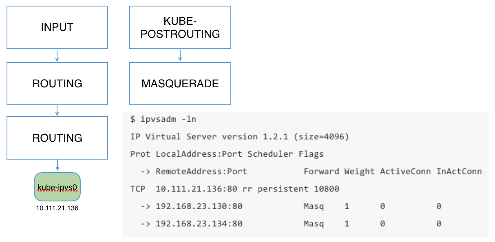

# kube-proxy

kube-proxy 會在叢集節點上執行，並實作 Service 網路功能；除非叢集網路提供者提供替代方案。Kubernetes v1.37 通常使用 iptables 模式，除非叢集明確設定其他模式。

自 v1.33 起，舊版 Endpoints API 已棄用。kube-proxy 使用 EndpointSlices 追蹤 Service 後端；診斷端點成員時，請使用 EndpointSlices：

```bash
kubectl get endpointslices -l kubernetes.io/service-name=<service-name>
```

## Proxy 模式

* `iptables`：支援且仍為預設模式。
* `nftables`：自 v1.33 起為 GA。確認與叢集網路提供者相容後，請用於核心版本為 5.13 或更新版本的支援 Linux 節點。此模式不是 v1.37 的預設模式。
* `ipvs`：自 v1.35 起已棄用。只有在叢集依賴此模式時才予以保留；請規劃遷移至 nftables 或 iptables。
* `winkernel`：Windows 節點的 Proxy 模式。

舊文件中所列的 `userspace` 和 `winuserspace` 模式屬於歷史模式，並非目前可選的部署方式。

舊版 IPVS 部署指南可能要求預先載入 `ip_vs`、`ip_vs_rr`、`ip_vs_wrr`、`ip_vs_sh` 和 `nf_conntrack` 核心模組。IPVS 已棄用；請勿將此設定用於 nftables 或 iptables 模式。請遵循發行版針對現存 IPVS 叢集提供的遷移說明。

如需在 Linux 節點上使用 kube-proxy nftables 模式的背景與操作檢查，請參閱 [nftables 章節](../../network/nftables.md)；該模式不是 v1.37 的預設值。

## Iptables 範例（歷史輸出）
以下靜態規則僅為歷史示意，並非 Kubernetes v1.37 的預設規則清單。實際規則取決於 Proxy 模式、位址和 Service 設定。

### Kube-proxy iptables 示意圖


（圖片來自 [cilium/k8s-iptables-diagram](https://github.com/cilium/k8s-iptables-diagram)）

### Kube-proxy NAT 示意圖


（圖片來自 [kube-proxy iptables "nat" control flow](https://docs.google.com/drawings/d/1MtWL8qRTs6PlnJrW4dh8135_S9e2SaawT410bJuoBPk/edit)）

### Iptables 範例（歷史輸出）

```bash
# Masquerade
-A KUBE-MARK-DROP -j MARK --set-xmark 0x8000/0x8000
-A KUBE-MARK-MASQ -j MARK --set-xmark 0x4000/0x4000
-A KUBE-POSTROUTING -m comment --comment "kubernetes service traffic requiring SNAT" -m mark --mark 0x4000/0x4000 -j MASQUERADE

# clusterIP and publicIP
-A KUBE-SERVICES ! -s 10.244.0.0/16 -d 10.98.154.163/32 -p tcp -m comment --comment "default/nginx: cluster IP" -m tcp --dport 80 -j KUBE-MARK-MASQ
-A KUBE-SERVICES -d 10.98.154.163/32 -p tcp -m comment --comment "default/nginx: cluster IP" -m tcp --dport 80 -j KUBE-SVC-4N57TFCL4MD7ZTDA
-A KUBE-SERVICES -d 12.12.12.12/32 -p tcp -m comment --comment "default/nginx: loadbalancer IP" -m tcp --dport 80 -j KUBE-FW-4N57TFCL4MD7ZTDA

# Masq for publicIP
-A KUBE-FW-4N57TFCL4MD7ZTDA -m comment --comment "default/nginx: loadbalancer IP" -j KUBE-MARK-MASQ
-A KUBE-FW-4N57TFCL4MD7ZTDA -m comment --comment "default/nginx: loadbalancer IP" -j KUBE-SVC-4N57TFCL4MD7ZTDA
-A KUBE-FW-4N57TFCL4MD7ZTDA -m comment --comment "default/nginx: loadbalancer IP" -j KUBE-MARK-DROP

# Masq for nodePort
-A KUBE-NODEPORTS -p tcp -m comment --comment "default/nginx:" -m tcp --dport 30938 -j KUBE-MARK-MASQ
-A KUBE-NODEPORTS -p tcp -m comment --comment "default/nginx:" -m tcp --dport 30938 -j KUBE-SVC-4N57TFCL4MD7ZTDA

# load balance for each endpoints
-A KUBE-SVC-4N57TFCL4MD7ZTDA -m comment --comment "default/nginx:" -m statistic --mode random --probability 0.33332999982 -j KUBE-SEP-UXHBWR5XIMVGXW3H
-A KUBE-SVC-4N57TFCL4MD7ZTDA -m comment --comment "default/nginx:" -m statistic --mode random --probability 0.50000000000 -j KUBE-SEP-TOYRWPNILILHH3OR
-A KUBE-SVC-4N57TFCL4MD7ZTDA -m comment --comment "default/nginx:" -j KUBE-SEP-6QCC2MHJZP35QQAR

# endpoint #1
-A KUBE-SEP-6QCC2MHJZP35QQAR -s 10.244.3.4/32 -m comment --comment "default/nginx:" -j KUBE-MARK-MASQ
-A KUBE-SEP-6QCC2MHJZP35QQAR -p tcp -m comment --comment "default/nginx:" -m tcp -j DNAT --to-destination 10.244.3.4:80

# endpoint #2
-A KUBE-SEP-TOYRWPNILILHH3OR -s 10.244.2.4/32 -m comment --comment "default/nginx:" -j KUBE-MARK-MASQ
-A KUBE-SEP-TOYRWPNILILHH3OR -p tcp -m comment --comment "default/nginx:" -m tcp -j DNAT --to-destination 10.244.2.4:80

# endpoint #3
-A KUBE-SEP-UXHBWR5XIMVGXW3H -s 10.244.1.2/32 -m comment --comment "default/nginx:" -j KUBE-MARK-MASQ
-A KUBE-SEP-UXHBWR5XIMVGXW3H -p tcp -m comment --comment "default/nginx:" -m tcp -j DNAT --to-destination 10.244.1.2:80
```

如果服務設定了 `externalTrafficPolicy: Local`，而且目前節點上沒有任何屬於該服務的 Pod，則會在 `KUBE-XLB-4N57TFCL4MD7ZTDA` 中直接丟棄來自公用 IP 的封包：

```bash
-A KUBE-XLB-4N57TFCL4MD7ZTDA -m comment --comment "default/nginx: has no local endpoints" -j KUBE-MARK-DROP
```

## IPVS 範例（已棄用的後端）
IPVS 自 Kubernetes v1.35 起已棄用。以下輸出僅供辨識舊版叢集使用，不代表建議的 v1.37 設定。

[Kube-proxy IPVS mode](https://github.com/kubernetes/kubernetes/blob/master/pkg/proxy/ipvs/README.md) 列出了各種服務在 IPVS 模式下的運作方式。



```bash
$ ipvsadm -ln
IP Virtual Server version 1.2.1 (size=4096)
Prot LocalAddress:Port Scheduler Flags
  -> RemoteAddress:Port           Forward Weight ActiveConn InActConn
TCP  10.0.0.1:443 rr persistent 10800
  -> 192.168.0.1:6443             Masq    1      1          0
TCP  10.0.0.10:53 rr
  -> 172.17.0.2:53                Masq    1      0          0
UDP  10.0.0.10:53 rr
  -> 172.17.0.2:53                Masq    1      0          0
```

請注意，IPVS 模式也會使用 iptables 執行 SNAT 和 IP 偽裝（MASQUERADE），並使用 ipset 簡化 iptables 規則的管理：

| ipset 名稱 | 成員 | 用途 |
| :--- | :--- | :--- |
| KUBE-CLUSTER-IP | 所有 Service IP + 連接埠 | 在 `masquerade-all=true` 或 `clusterCIDR` 指定的情況下標記為 Masq |
| KUBE-LOOP-BACK | 所有 Service IP + 連接埠 + IP | 為解決 hairpin 問題而進行偽裝 |
| KUBE-EXTERNAL-IP | Service 外部 IP + 連接埠 | 對傳送至外部 IP 的封包進行偽裝 |
| KUBE-LOAD-BALANCER | 負載平衡器入口 IP + 連接埠 | 對傳送至負載平衡器類型服務的封包進行偽裝 |
| KUBE-LOAD-BALANCER-LOCAL | 含 `externalTrafficPolicy=local` 的負載平衡器入口 IP + 連接埠 | 接受傳送至含 `externalTrafficPolicy=local` 的負載平衡器的封包 |
| KUBE-LOAD-BALANCER-FW | 含 `loadBalancerSourceRanges` 的負載平衡器入口 IP + 連接埠 | 篩選含 `loadBalancerSourceRanges` 的負載平衡器封包 |
| KUBE-LOAD-BALANCER-SOURCE-CIDR | 負載平衡器入口 IP + 連接埠 + 來源 CIDR | 篩選含 `loadBalancerSourceRanges` 的負載平衡器封包 |
| KUBE-NODE-PORT-TCP | NodePort 類型服務的 TCP 連接埠 | 對傳送至 nodePort（TCP）的封包進行偽裝 |
| KUBE-NODE-PORT-LOCAL-TCP | 含 `externalTrafficPolicy=local` 的 NodePort 類型服務 TCP 連接埠 | 接受傳送至含 `externalTrafficPolicy=local` 的 NodePort 服務的封包 |
| KUBE-NODE-PORT-UDP | NodePort 類型服務的 UDP 連接埠 | 對傳送至 nodePort（UDP）的封包進行偽裝 |
| KUBE-NODE-PORT-LOCAL-UDP | 含`externalTrafficPolicy=local` 的 NodePort 類型服務 UDP 連接埠 | 接受傳送至含`externalTrafficPolicy=local` 的 NodePort 服務的封包 |

## 設定 kube-proxy

選擇 Proxy 模式時，請先檢查叢集發行版、作業系統、核心版本和 CNI 實作的需求。Kubernetes v1.37 的 kubeadm 在未提供模式時會明確選擇 iptables，並對 IPVS 發出棄用警告。請勿只修改 kube-proxy ConfigMap 就切換執行中的叢集；請依照發行版文件規劃設定變更和節點的滾動更新。

```yaml
apiVersion: kubeproxy.config.k8s.io/v1alpha1
kind: KubeProxyConfiguration
mode: nftables
```

上述設定片段僅說明如何選擇模式，並非適用於所有發行版的完整 kube-proxy 設定。設定檔位置和重新啟動流程取決於叢集部署方式。

以下提供 iptables 規則和 IPVS 表的歷史範例。輸出內容取決於所選 Proxy 模式和叢集設定，僅供理解封包轉送之用。排解問題時，請先讀取目前的規則，不要直接複製或刪除範例規則。