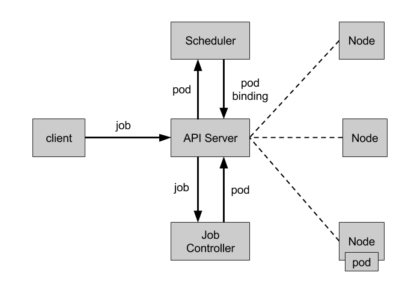

# Job

Job 負責批次處理短期的一次性任務 \(short lived one-off tasks\)，即只需執行一次的工作，並確保一個或多個 Pod 成功結束。

## API 版本對照表

| Kubernetes 版本 | Batch API 版本 | 預設開啟 |
| :--- | :--- | :--- |
| v1.5+ | batch/v1 | 是 |

## Job 型別

Kubernetes 支援以下幾種 Job：

* 非並行 Job：通常建立一個 Pod 直至其成功結束
* 固定結束次數的 Job：設定 `.spec.completions`，建立多個 Pod，直到 `.spec.completions` 個 Pod 成功結束
* 帶有工作佇列的並行 Job：設定 `.spec.Parallelism` 但不設定 `.spec.completions`，當所有 Pod 結束並且至少一個成功時，Job 就認為是成功

根據 `.spec.completions` 和 `.spec.Parallelism` 的設定，可以將 Job 分為幾種類型：

| Job 型別 | 使用範例 | 行為 | completions | Parallelism |
| :--- | :--- | :--- | :--- | :--- |
| 一次性 Job | 資料庫遷移 | 建立一個 Pod 直至其成功結束 | 1 | 1 |
| 固定結束次數的 Job | 處理工作佇列的 Pod | 依序建立一個 Pod 執行直至 completions 個成功結束 | 2+ | 1 |
| 固定結束次數的並行 Job | 多個 Pod 同時處理工作佇列 | 依序建立多個 Pod 執行直至 completions 個成功結束 | 2+ | 2+ |
| 並行 Job | 多個 Pod 同時處理工作佇列 | 建立一個或多個 Pod 直至有一個成功結束 | 1 | 2+ |

## Job Controller

Job Controller 負責根據 Job Spec 建立 Pod，並持續監控 Pod 的狀態，直至其成功結束。如果失敗，則根據 restartPolicy（只支援 OnFailure 和 Never，不支援 Always）決定是否建立新的 Pod 再次重試任務。



## Job Spec 格式

* spec.template 格式同 Pod
* RestartPolicy 僅支援 Never 或 OnFailure
* 單個 Pod 時，預設 Pod 成功執行後 Job 即結束
* `.spec.completions` 標誌 Job 結束需要成功執行的 Pod 個數，預設為 1
* `.spec.parallelism` 標誌並行執行的 Pod 的個數，預設為 1
* `spec.activeDeadlineSeconds` 標誌失敗 Pod 的重試最大時間，超過這個時間不會繼續重試
* `.spec.completionMode` 完成模式，支援 NonIndexed（預設）和 Indexed
* `.spec.backoffLimitPerIndex` （v1.33+ 穩定）為索引化 Job 設定每個索引的回復限制
* `.spec.maxFailedIndexes` （v1.33+ 穩定）限制索引化 Job 中允許失敗的最大索引數
* `.spec.successPolicy` （v1.33+ 穩定）定義 Job 成功完成的條件
* `.spec.suspend` （v1.21+ 穩定）暫停 Job 的執行

一個簡單的例子：

```yaml
apiVersion: batch/v1
kind: Job
metadata:
  name: pi
spec:
  template:
    metadata:
      name: pi
    spec:
      containers:
      - name: pi
        image: perl:5.44.0
        command: ["perl",  "-Mbignum=bpi", "-wle", "print bpi(2000)"]
      restartPolicy: Never
```

```bash
# 创建 Job
$ kubectl create -f ./job.yaml
job "pi" created
# 查看 Job 的状态
$ kubectl describe job pi
Name:        pi
Namespace:    default
Selector:    controller-uid=cd37a621-5b02-11e7-b56e-76933ddd7f55
Labels:        controller-uid=cd37a621-5b02-11e7-b56e-76933ddd7f55
        job-name=pi
Annotations:    <none>
Parallelism:    1
Completions:    1
Start Time:    Tue, 27 Jun 2017 14:35:24 +0800
Pods Statuses:    0 Running / 1 Succeeded / 0 Failed
Pod Template:
  Labels:    controller-uid=cd37a621-5b02-11e7-b56e-76933ddd7f55
        job-name=pi
  Containers:
   pi:
    Image:    perl:5.44.0
    Port:
    Command:
      perl
      -Mbignum=bpi
      -wle
      print bpi(2000)
    Environment:    <none>
    Mounts:        <none>
  Volumes:        <none>
Events:
  FirstSeen    LastSeen    Count    From        SubObjectPath    Type        Reason            Message
  ---------    --------    -----    ----        -------------    --------    ------            -------
  2m        2m        1    job-controller            Normal        SuccessfulCreate    Created pod: pi-nltxv

# 使用'job-name=pi'标签查询属于该 Job 的 Pod
# 注意不要忘记'--show-all'选项显示已经成功（或失败）的 Pod
$ kubectl get pod --show-all -l job-name=pi
NAME       READY     STATUS      RESTARTS   AGE
pi-nltxv   0/1       Completed   0          3m

# 使用 jsonpath 获取 pod ID 并查看 Pod 的日志
$ pods=$(kubectl get pods --selector=job-name=pi --output=jsonpath={.items..metadata.name})
$ kubectl logs $pods
3.141592653589793238462643383279502...
```

固定結束次數的 Job 範例

```yaml
apiVersion: batch/v1
kind: Job
metadata:
  name: busybox
spec:
  completions: 3
  template:
    metadata:
      name: busybox
    spec:
      containers:
      - name: busybox
        image: busybox:1.37.0
        command: ["echo", "hello"]
      restartPolicy: Never
```

## Indexed Job

通常，當使用 Job 來執行分散式任務時，使用者需要一個單獨的系統來在 Job 的不同 worker Pod 之間分配任務。比如，設定一個工作佇列，逐一給每個 Pod 分配任務。Kubernetes v1.21 新增的 Indexed Job 會給每個任務分配一個數值索引，並透過 annotation `batch.kubernetes.io/job-completion-index` 暴露給每個 Pod。使用方法為在 Job spec 中設定 `completionMode: Indexed`。

### 索引化 Job 的回復限制 (v1.33.0 Stable)

從 Kubernetes v1.33.0 開始，支援為索引化 Job 的每個索引設定獨立的回復限制。這項功能專為「embarrassingly parallel」（易於平行化）的工作負載設計，其中每個索引代表獨立的任務。

#### 功能優勢

- **精細化失敗控制**：防止單個失敗的索引消耗整個 Job 的失敗預算
- **獨立重試機制**：每個索引可以獨立重試，不影響其他索引的執行
- **更好的容錯性**：支援部分索引失敗的場景，提高整體 Job 的成功率

#### 設定引數

- `backoffLimitPerIndex`：控制每個索引的重試次數
- `maxFailedIndexes`：（可選）限制總的失敗索引數量
- 可以與 Pod 失敗策略搭配使用，以提供更進階的錯誤處理方式

#### 基本範例

```yaml
apiVersion: batch/v1
kind: Job
metadata:
  name: indexed-job-with-backoff
spec:
  completionMode: Indexed
  completions: 10
  parallelism: 10
  backoffLimitPerIndex: 1    # 每个索引最多重试1次
  maxFailedIndexes: 5        # 最多允许5个索引失败
  template:
    spec:
      containers:
      - name: worker
        image: busybox:1.37.0
        command:
        - sh
        - -c
        - |
          INDEX=${JOB_COMPLETION_INDEX}
          echo "Processing index $INDEX"
          # 模拟某些索引可能失败的情况
          if [ $((INDEX % 3)) -eq 0 ]; then
            echo "Index $INDEX: simulating failure"
            exit 1
          else
            echo "Index $INDEX: success"
            exit 0
          fi
      restartPolicy: Never
```

#### 實際應用場景

1. **多測試套件執行**：執行多個獨立的測試套件，單個套件失敗不影響其他套件
2. **批次資料處理**：處理多個資料檔案，某個檔案處理失敗不影響其他檔案
3. **平行計算任務**：執行多個獨立的計算任務，具有一定的失敗容忍度

#### 設定建議

- 對於需要高可靠性的任務，設定較高的 `backoffLimitPerIndex` 值
- 使用 `maxFailedIndexes` 控制整體失敗率，避免過多失敗索引
- 結合 Pod 失敗策略可以根據不同的失敗原因採取不同的重試策略

## Job 成功策略 (v1.33.0 GA)

Job 成功策略在 Kubernetes v1.33.0 進入穩定版（GA）。這項功能專為批次處理工作負載設計，例如科學模擬、AI/ML 和高效能運算（HPC）。它允許指定哪些 Pod 索引或數量必須成功完成，以支援部分 Job 完成的情境。

### 功能特點

- **僅適用於索引化 Job**：只能在 `completionMode: Indexed` 的 Job 中使用
- **靈活的成功條件**：可以根據成功的索引數量或特定的索引來定義成功
- **早期退出**：一旦滿足成功條件，Job 會立即停止所有 Pod
- **支援領導者-跟隨者模式**：適用於只需要特定索引成功的場景

### 基本範例：單個索引成功

```yaml
apiVersion: batch/v1
kind: Job
metadata:
  name: single-index-success
spec:
  completionMode: Indexed
  completions: 5
  parallelism: 5
  successPolicy:
    rules:
    - succeededCount: 1  # 只需要一个 Pod 成功即可
  template:
    spec:
      containers:
      - name: worker
        image: busybox:1.37.0
        command: ["sh", "-c", "echo Processing index $JOB_COMPLETION_INDEX && sleep $((RANDOM % 60))"]
      restartPolicy: Never
```

### 高階範例：領導者索引成功

```yaml
apiVersion: batch/v1
kind: Job
metadata:
  name: leader-follower-job
spec:
  completionMode: Indexed
  completions: 10
  parallelism: 3
  successPolicy:
    rules:
    - succeededIndexes: "0"    # 索引 0 作为领导者必须成功
      succeededCount: 1
  template:
    spec:
      containers:
      - name: worker
        image: busybox:1.37.0
        command:
        - sh
        - -c
        - |
          INDEX=${JOB_COMPLETION_INDEX}
          if [ $INDEX -eq 0 ]; then
            echo "Leader processing index $INDEX"
            # 领导者逻辑
            sleep 30
          else
            echo "Follower processing index $INDEX"
            # 跟随者逻辑
            sleep 10
          fi
      restartPolicy: Never
```

### 組合條件範例

```yaml
apiVersion: batch/v1
kind: Job
metadata:
  name: complex-success-policy
spec:
  completionMode: Indexed
  completions: 10
  parallelism: 3
  successPolicy:
    rules:
    - succeededIndexes: "0-2,5"  # 特定索引必须成功
    - succeededCount: 6          # 或者至少6个Pod成功
  template:
    spec:
      containers:
      - name: worker
        image: busybox:1.37.0
        command: ["sh", "-c", "echo Processing index $JOB_COMPLETION_INDEX && sleep 10"]
      restartPolicy: Never
```

### 應用場景

1. **科學模擬**：多個實驗中只需要部分結果成功即可
2. **AI/ML 訓練**：分散式訓練中需要特定節點成功
3. **高效能運算**：平行計算任務中只需要部分結果
4. **批次資料處理**：在大規模資料處理中允許部分失敗
5. **領導者-跟隨者模式**：只需要領導者節點成功完成任務

### 技術細節

- **條件檢查**：Job Controller 會在滿足成功策略時新增 `SuccessCriteriaMet` 條件
- **Pod 終止**：成功條件達成後，所有正在執行的 Pod 會被終止
- **資源最佳化**：避免不必要的計算資源浪費

### 最佳實踐

- **僅用於索引化 Job**：確保設定 `completionMode: Indexed`
- **合理設定成功條件**：根據業務需求設定合適的 `succeededCount` 或 `succeededIndexes`
- **結合失敗策略**：可與 `backoffLimitPerIndex` 和 `maxFailedIndexes` 結合使用
- **監控 Job 狀態**：透過 Job conditions 監控成功條件的達成

## 完成後自動清理 Job

TTL-after-finished 控制器會在 Job 進入 `Complete` 或 `Failed` 後，等待 `.spec.ttlSecondsAfterFinished` 指定的秒數，再刪除該 Job 及其相依資源（包括 Job 建立的 Pods）。此欄位屬於 Job，不是 Pod；若要保留記錄或輸出，請在到期前先行保存。各節點與控制平面的時鐘應保持同步。詳見 [Job 自動清理文件](https://kubernetes.io/docs/concepts/workloads/controllers/ttlafterfinished/)。

## 暫停及繼續 Job

Job 的 `.spec.suspend` 自 v1.24 起為穩定功能。以下完整範例會先建立暫停中的 Job；將 `suspend` 設為 `false` 可繼續執行 Job，並在需要時建立 Pod。暫停 Job 會終止正在執行的 Pod；繼續 Job 不會重新啟動同一個既有 Pod。詳見 [Job 文件](https://kubernetes.io/docs/concepts/workloads/controllers/job/)。

```yaml
apiVersion: batch/v1
kind: Job
metadata:
  name: myjob
spec:
  suspend: true
  ttlSecondsAfterFinished: 3600
  parallelism: 1
  completions: 1
  template:
    spec:
      restartPolicy: Never
      containers:
        - name: worker
          image: busybox:1.37.0
          command: ["sh", "-c", "echo job completed"]
```

```sh
kubectl apply -f job.yaml
kubectl get job myjob
kubectl patch job myjob --type=merge -p '{"spec":{"suspend":false}}'
kubectl get job myjob
```

若要從頭執行新的工作，請建立新的 Job（通常使用新的名稱）；不要將繼續執行既有 Job 誤認為重新啟動同一個 Pod。

## Bare Pods

Bare Pod 是直接根據 PodSpec 建立、未受 ReplicaSets 或 ReplicationCtroller 管理的 Pod。Node 重新啟動後，這些 Pod 不會自動重新啟動，但 Job 會建立新的 Pod 繼續執行任務。因此，即使應用只需要一個 Pod，也建議使用 Job 取代 Bare Pod。

## 參考文件

* [Jobs - Run to Completion](https://kubernetes.io/docs/concepts/workloads/controllers/jobs-run-to-completion/)
