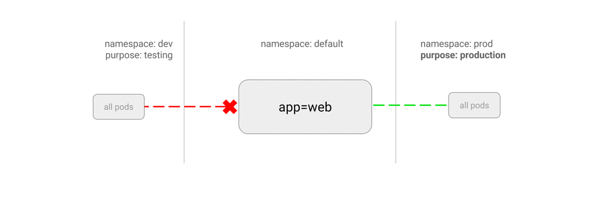

# NetworkPolicy

隨著微服務的流行，越來越多的雲服務平台需要大量模組之間的網路呼叫。Kubernetes 在 1.3 引入了 Network Policy，Network Policy 提供了基於策略的網路控制，用於隔離應用並減少攻擊面。它使用標籤選擇器模擬傳統的分段網路，並透過策略控制它們之間的流量以及來自外部的流量。

當前 API 為 `networking.k8s.io/v1`。`endPort` 欄位自 v1.25 起穩定，不需要啟用 feature gate。NetworkPolicy 的執行依賴叢集 CNI/資料平面實現支援 NetworkPolicy；建立資源本身不會自動啟用隔離。

請使用所選 CNI 廠商當前受維護的部署文件。Calico、Cilium 等實現提供 NetworkPolicy 支援；舊版 Weave Net、Romana 等內容僅作歷史參考，不應作為新叢集部署指南。

## API 版本

| API version | 狀態 |
| :--- | :--- |
| `networking.k8s.io/v1` | 當前版本 |
| `extensions/v1beta1` | 歷史 API，自 v1.16 起不再提供 |

## 網路策略

### Namespace 隔離

預設情況下，所有 Pod 之間是全通的。每個 Namespace 可以設定獨立的網路策略，來隔離 Pod 之間的流量。

v1.7 + 版本透過建立匹配所有 Pod 的 Network Policy 來作為預設的網路策略，比如預設拒絕所有 Pod 之間 Ingress 通訊

```yaml
apiVersion: networking.k8s.io/v1
kind: NetworkPolicy
metadata:
  name: default-deny
spec:
  podSelector: {}
  policyTypes:
  - Ingress
```

預設拒絕所有 Pod 之間 Egress 通訊的策略為

```yaml
apiVersion: networking.k8s.io/v1
kind: NetworkPolicy
metadata:
  name: default-deny
spec:
  podSelector: {}
  policyTypes:
  - Egress
```

甚至是預設拒絕所有 Pod 之間 Ingress 和 Egress 通訊的策略為

```yaml
apiVersion: networking.k8s.io/v1
kind: NetworkPolicy
metadata:
  name: default-deny
spec:
  podSelector: {}
  policyTypes:
  - Ingress
  - Egress
```

而預設允許所有 Pod 之間 Ingress 通訊的策略為

```yaml
apiVersion: networking.k8s.io/v1
kind: NetworkPolicy
metadata:
  name: allow-all
spec:
  podSelector: {}
  ingress:
  - {}
```

預設允許所有 Pod 之間 Egress 通訊的策略為

```yaml
apiVersion: networking.k8s.io/v1
kind: NetworkPolicy
metadata:
  name: allow-all
spec:
  podSelector: {}
  egress:
  - {}
```

舊版叢集曾使用 annotation 設定網路隔離；該方式不屬於當前 NetworkPolicy API，不要在 v1.37 叢集上依賴它。請使用前述 `networking.k8s.io/v1` 清單。

### Pod 隔離

透過使用標籤選擇器（包括 namespaceSelector 和 podSelector）來控制 Pod 之間的流量。比如下面的 Network Policy

* 允許 default namespace 中帶有 `role=frontend` 標籤的 Pod 存取 default namespace 中帶有 `role=db` 標籤 Pod 的 6379 連接埠
* 允許帶有 `project=myprojects` 標籤的 namespace 中所有 Pod 存取 default namespace 中帶有 `role=db` 標籤 Pod 的 6379 連接埠

```yaml
# v1.6 以及更老的版本应该使用 extensions/v1beta1
# apiVersion: extensions/v1beta1
apiVersion: networking.k8s.io/v1
kind: NetworkPolicy
metadata:
  name: test-network-policy
  namespace: default
spec:
  podSelector:
    matchLabels:
      role: db
  ingress:
  - from:
    - namespaceSelector:
        matchLabels:
          project: myproject
    - podSelector:
        matchLabels:
          role: frontend
    ports:
    - protocol: tcp
      port: 6379
```

另外一個同時開啟 Ingress 和 Egress 通訊的策略為

```yaml
apiVersion: networking.k8s.io/v1
kind: NetworkPolicy
metadata:
  name: test-network-policy
  namespace: default
spec:
  podSelector:
    matchLabels:
      role: db
  policyTypes:
  - Ingress
  - Egress
  ingress:
  - from:
    - ipBlock:
        cidr: 172.17.0.0/16
        except:
        - 172.17.1.0/24
    - namespaceSelector:
        matchLabels:
          project: myproject
    - podSelector:
        matchLabels:
          role: frontend
    ports:
    - protocol: TCP
      port: 6379
  egress:
  - to:
    - ipBlock:
        cidr: 10.0.0.0/24
    ports:
    - protocol: TCP
      port: 5978
```

它用來隔離 default namespace 中帶有 `role=db` 標籤的 Pod：

* 允許 default namespace 中帶有 `role=frontend` 標籤的 Pod 存取 default namespace 中帶有 `role=db` 標籤 Pod 的 6379 連接埠
* 允許帶有 `project=myprojects` 標籤的 namespace 中所有 Pod 存取 default namespace 中帶有 `role=db` 標籤 Pod 的 6379 連接埠
* 允許 default namespace 中帶有 `role=db` 標籤的 Pod 存取 `10.0.0.0/24` 網段的 TCP 5987 連接埠

## 簡單範例

本例假設叢集 CNI 已安裝並支援 NetworkPolicy enforcement。NetworkPolicy API 建立成功並不表示流量已經被過濾。

先建立用於測試的 Deployment 和 Service：

```bash
kubectl create deployment nginx --image=nginx:1.30.5 --replicas=2
kubectl expose deployment nginx --port=80
```

以下策略拒絕 default namespace 中所有 Pod 到 nginx Pod 的入站連線；儲存為 `default-deny.yaml`：

```yaml
# default-deny.yaml
apiVersion: networking.k8s.io/v1
kind: NetworkPolicy
metadata:
  name: default-deny-nginx
spec:
  podSelector:
    matchLabels:
      app: nginx
  policyTypes:
  - Ingress
```

應用策略後，可啟動臨時客戶端檢查存取行為：

```bash
kubectl apply -f default-deny.yaml
kubectl run netcheck --image=busybox:1.37.0 --restart=Never --rm -it -- \
  wget -qO- --timeout=2 http://nginx
```

若只允許帶 `access=true` 標籤的 Pod 存取 nginx，可將以下策略儲存為 `allow-access-nginx.yaml`。該策略與拒絕策略共同生效：

```yaml
# allow-access-nginx.yaml
apiVersion: networking.k8s.io/v1
kind: NetworkPolicy
metadata:
  name: allow-access-nginx
spec:
  podSelector:
    matchLabels:
      app: nginx
  policyTypes:
  - Ingress
  ingress:
  - from:
    - podSelector:
        matchLabels:
          access: "true"
    ports:
    - protocol: TCP
      port: 80
```

分別執行不帶標籤和帶標籤的客戶端驗證 CNI 實際執行結果：

```bash
kubectl apply -f allow-access-nginx.yaml
kubectl run netcheck --image=busybox:1.37.0 --restart=Never --rm -it -- \
  wget -qO- --timeout=2 http://nginx
kubectl run netcheck --image=busybox:1.37.0 --restart=Never --rm -it --labels=access=true -- \
  wget -qO- --timeout=2 http://nginx
```

## 使用場景

### 禁止存取指定服務

```bash
kubectl run web --image=nginx:1.30.5 --labels app=web,env=prod --expose --port 80
```


網路策略

```yaml
kind: NetworkPolicy
apiVersion: networking.k8s.io/v1
metadata:
  name: web-deny-all
spec:
  podSelector:
    matchLabels:
      app: web
      env: prod
```

### 只允許指定 Pod 存取服務

```bash
kubectl run apiserver --image=nginx:1.30.5 --labels app=bookstore,role=api --expose --port 80
```


網路策略

```yaml
kind: NetworkPolicy
apiVersion: networking.k8s.io/v1
metadata:
  name: api-allow
spec:
  podSelector:
    matchLabels:
      app: bookstore
      role: api
  ingress:
  - from:
      - podSelector:
          matchLabels:
            app: bookstore
```

### 禁止 namespace 中所有 Pod 之間的相互存取


```yaml
apiVersion: networking.k8s.io/v1
kind: NetworkPolicy
metadata:
  name: default-deny
  namespace: default
spec:
  podSelector: {}
```

### 禁止其他 namespace 存取服務

```bash
kubectl create namespace secondary
kubectl run web --namespace secondary --image=nginx:1.30.5 \
    --labels=app=web --expose --port 80
```


網路策略

```yaml
kind: NetworkPolicy
apiVersion: networking.k8s.io/v1
metadata:
  namespace: secondary
  name: web-deny-other-namespaces
spec:
  podSelector: {}
  ingress:
  - from:
    - podSelector: {}
```

### 只允許指定 namespace 存取服務

```bash
kubectl run web --image=nginx:1.30.5 \
    --labels=app=web --expose --port 80
```



網路策略

```yaml
kind: NetworkPolicy
apiVersion: networking.k8s.io/v1
metadata:
  name: web-allow-prod
spec:
  podSelector:
    matchLabels:
      app: web
  ingress:
  - from:
    - namespaceSelector:
        matchLabels:
          purpose: production
```

### 允許外網存取服務

`LoadBalancer` 可能建立可從叢集外存取的負載平衡器並產生費用；僅在確認雲端平台、入口 ACL/防火牆和工作負載安全設定後使用。NetworkPolicy 不能替代外部防火牆或負載平衡器存取控制。

```bash
kubectl create deployment web --image=nginx:1.30.5
kubectl expose deployment web --type=LoadBalancer --port=80
```


網路策略

```yaml
kind: NetworkPolicy
apiVersion: networking.k8s.io/v1
metadata:
  name: web-allow-external
spec:
  podSelector:
    matchLabels:
      app: web
  ingress:
  - ports:
    - port: 80
```

## 不支援場景

- 強制叢集內部流量經過某公用閘道器（這種場景最好透過服務網格或其他代理來實現）；
- 與 TLS 相關的場景（考慮使用服務網格或者 Ingress 控制器）；
- 特定於節點的策略（你可以使用 CIDR 來表達這一需求不過你無法使用節點在 Kubernetes 中的其他標識資訊來辯識目標節點）；
- 基於名字來選擇服務（不過，你可以使用 標籤 來選擇目標 Pod 或名字空間，這也通常是一種可靠的替代方案）；
- 建立或管理由第三方來實際完成的“策略請求”；
- 實現適用於所有名字空間或 Pods 的預設策略（某些第三方 Kubernetes 發行版本 或專案可以做到這點）；
- 高階的策略查詢或者可達性相關工具；
- 生成網路安全事件日誌的能力（例如，被阻塞或接收的連線請求）；
- 顯式地拒絕策略的能力（目前，NetworkPolicy 的模型預設採用拒絕操作， 其唯一的能力是新增允許策略）；
- 禁止本地迴路或指向宿主的網路流量（Pod 目前無法阻塞 localhost 存取， 它們也無法禁止來自所在節點的存取請求）。

## 參考文件

* [Kubernetes network policies](https://kubernetes.io/docs/concepts/services-networking/network-policies/)
* [Declare Network Policy](https://kubernetes.io/docs/tasks/administer-cluster/declare-network-policy/)
* [Securing Kubernetes Cluster Networking](https://ahmet.im/blog/kubernetes-network-policy/)
* [Kubernetes Network Policy Recipes](https://github.com/ahmetb/kubernetes-networkpolicy-tutorial)
