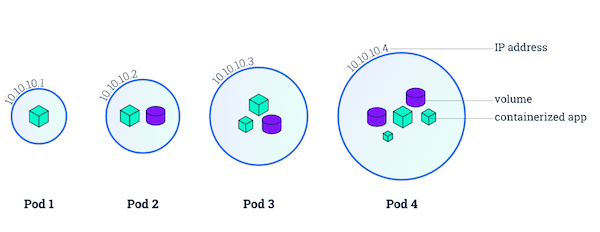

# Pod

Pod 是一組緊密關聯的容器，也是 Kubernetes 排程的基本單位。Pod 內容器共享網路與 IPC 命名空間；檔案不會自動共享，需透過 Pod 卷掛載到各容器。



Pod 的特徵

* 包含多個共享 IPC 和 Network namespace 的容器，可直接透過 localhost 通訊
* 所有 Pod 內容器都可以存取共享的 Volume，可以存取共享資料
* 無容錯性：直接建立的 Pod 一旦被排程後就跟 Node 綁定，即使 Node 掛掉也不會被重新排程（而是被自動刪除），因此推薦使用 Deployment、Daemonset 等控制器來容錯
* 優雅終止：Pod 刪除的時候先給其內的程序傳送 SIGTERM，等待一段時間（grace period）後才強制停止依然還在執行的程序
* 特權容器（透過 SecurityContext 設定）具有改變系統設定的權限（在網路外掛中大量應用）

Kubernetes 支援透過 PodSpec 的 `shareProcessNamespace: true` 讓 Pod 內容器共享程序命名空間。該設定由 kubelet 與所用 CRI 執行時配合實現，不需要設定 Docker 專用 kubelet 引數。

> **使用者命名空間隔離：** `UserNamespacesSupport` 在 Kubernetes v1.37 仍為 Beta，feature gate 自 v1.33 起預設開啟。Linux Pod 可設定 `hostUsers: false` 請求使用者命名空間；執行時、核心和卷的支援情況需按目標叢集確認：
>
> ```yaml
> spec:
>   hostUsers: false
> ```

## API 版本對照表

| Kubernetes 版本 | Core API 版本 | 預設開啟 |
| :--- | :--- | :--- |
| v1.5+ | core/v1 | 是 |

## Pod 定義

透過 [YAML 或 JSON 描述 Pod](https://kubernetes.io/docs/reference/kubernetes-api/workload-resources/pod-v1/) 及其容器的執行環境與期望狀態。例如，最簡單的 nginx Pod 可定義為：

```yaml
apiVersion: v1
kind: Pod
metadata:
  name: nginx
  labels:
    app: nginx
spec:
  containers:
  - name: nginx
    image: nginx:1.30.5
    ports:
    - containerPort: 80
```

> 在生產環境中，推薦使用 Deployment、StatefulSet、Job 或者 CronJob 等控制器來建立 Pod，而不推薦直接建立 Pod。

## 容器映像檔

Kubernetes 透過 CRI 容器執行時啟動容器。執行時會拉取並執行相容的容器映像檔，通常使用 OCI 映像檔格式。Kubernetes 不會建置 Dockerfile，也不會在執行時逐項解讀 Dockerfile 指令。映像檔中的預設啟動命令、環境變數、使用者及工作目錄可依容器設定覆寫；容器連接埠需由 Pod 的 `ports` 欄位描述，健康檢查則使用 Kubernetes probes。

## Pod 生命週期

Kubernetes 以 `PodStatus.Phase` 抽象 Pod 的狀態（但並不直接反映所有容器的狀態）。可能的 Phase 包括

* Pending: API Server已經建立該Pod，但一個或多個容器還沒有被建立，包括透過網路下載映像檔的過程。
* Running: Pod中的所有容器都已經被建立且已經排程到 Node 上面，但至少有一個容器還在執行或者正在啟動。
* Succeeded: Pod 排程到 Node 上面後均成功執行結束，並且不會重啟。
* Failed: Pod中的所有容器都被終止了，但至少有一個容器退出失敗（即退出碼不為 0 或者被系統終止）。
* Unknonwn: 狀態未知，因為一些原因Pod無法被正常獲取，通常是由於 apiserver 無法與 kubelet 通訊導致。

可以用 kubectl 命令查詢 Pod Phase：

```bash
$ kubectl get pod reviews-v1-5bdc544bbd-5qgxj -o jsonpath="{.status.phase}"
Running
```

PodSpec 中的 `restartPolicy` 可以用來設定是否對退出的 Pod 重啟，可選項包括 `Always`、`OnFailure`、以及 `Never`。比如

* 單容器的 Pod，容器成功退出時，不同 `restartPolicy` 時的動作為
  * Always: 重啟 Container; Pod `phase` 保持 Running.
  * OnFailure: Pod `phase` 變成 Succeeded.
  * Never: Pod `phase` 變成 Succeeded.
* 單容器的 Pod，容器失敗退出時，不同 `restartPolicy` 時的動作為
  * Always: 重啟 Container; Pod `phase` 保持 Running.
  * OnFailure: 重啟 Container; Pod `phase` 保持 Running.
  * Never: Pod `phase` 變成 Failed.
* 2個容器的 Pod，其中一個容器在執行而另一個失敗退出時，不同 `restartPolicy` 時的動作為
  * Always: 重啟 Container; Pod `phase` 保持 Running.
  * OnFailure: 重啟 Container; Pod `phase` 保持 Running.
  * Never: 不重啟 Container; Pod `phase` 保持 Running.
* 2個容器的 Pod，其中一個容器停止而另一個失敗退出時，不同 `restartPolicy` 時的動作為
  * Always: 重啟 Container; Pod `phase` 保持 Running.
  * OnFailure: 重啟 Container; Pod `phase` 保持 Running.
  * Never: Pod `phase` 變成 Failed.
* 單容器的 Pod，容器記憶體不足（OOM），不同 `restartPolicy` 時的動作為
  * Always: 重啟 Container; Pod `phase` 保持 Running.
  * OnFailure: 重啟 Container; Pod `phase` 保持 Running.
  * Never: 記錄失敗事件; Pod `phase` 變成 Failed.
* Pod 還在執行，但磁碟不可存取時
  * 終止所有容器
  * Pod `phase` 變成 Failed
  * 如果 Pod 是由某個控制器管理的，則重新建立一個 Pod 並排程到其他 Node 執行
* Pod 還在執行，但由於網路分割槽故障導致 Node 無法存取
  * Node controller等待 Node 事件超時
  * Node controller 將 Pod `phase` 設定為 Failed.
  * 如果 Pod 是由某個控制器管理的，則重新建立一個 Pod 並排程到其他 Node 執行

## 使用 Volume

Volume 可以為容器提供持久化儲存，比如

```yaml
apiVersion: v1
kind: Pod
metadata:
  name: redis
spec:
  containers:
  - name: redis
    image: redis:8.10.2
    volumeMounts:
    - name: redis-storage
      mountPath: /data/redis
  volumes:
  - name: redis-storage
    emptyDir: {}
```

更多掛載儲存卷的方法參考 [Volume](volume.md)。

## 私有映像檔

在使用私有映像檔時，需要建立一個 docker registry secret，並在容器中引用。

建立 docker registry secret：

```bash
kubectl create secret docker-registry regsecret --docker-server=<your-registry-server> --docker-username=<your-name> --docker-password=<your-pword> --docker-email=<your-email>
```

比如使用 Azure Container Registry（ACR）：

```bash
ACR_NAME=dregistry
SERVICE_PRINCIPAL_NAME=acr-service-principal

# Populate the ACR login server and resource id.
ACR_LOGIN_SERVER=$(az acr show --name $ACR_NAME --query loginServer --output tsv)
ACR_REGISTRY_ID=$(az acr show --name $ACR_NAME --query id --output tsv)

# Create a contributor role assignment with a scope of the ACR resource.
SP_PASSWD=$(az ad sp create-for-rbac --name $SERVICE_PRINCIPAL_NAME --role Reader --scopes $ACR_REGISTRY_ID --query password --output tsv)

# Get the service principle client id.
CLIENT_ID=$(az ad sp show --id http://$SERVICE_PRINCIPAL_NAME --query appId --output tsv)

# Create secret
kubectl create secret docker-registry acr-auth --docker-server $ACR_LOGIN_SERVER --docker-username $CLIENT_ID --docker-password $SP_PASSWD --docker-email local@local.domain
```

下列 `myregistry.azurecr.io`、儲存庫名稱及 `replace-me` 都是佔位值；請換成自己有權限使用的 Azure Container Registry 登入伺服器，以及已推送的實際映像檔標籤。範例 Azure 變數也必須填入該 Registry 的實際設定。

在引用 docker registry secret 時，有兩種可選的方法：

```yaml
apiVersion: v1
kind: Pod
metadata:
  name: private-reg
spec:
  containers:
    - name: private-reg-container
      image: myregistry.azurecr.io/acr-auth-example:replace-me
  imagePullSecrets:
    - name: acr-auth
```

若多個 Pod 要共用 image pull Secret，請為應用程式建立專用 ServiceAccount，並在 Pod template 指定 `serviceAccountName`。不要修改命名空間的 `default` ServiceAccount，否則所有使用它的工作負載都會受影響：

```yaml
apiVersion: v1
kind: ServiceAccount
metadata:
  name: web-image-puller
  namespace: default
imagePullSecrets:
  - name: myregistrykey
```

將 Pod 或 Deployment template 的 `spec.serviceAccountName` 設為 `web-image-puller`。預設自動掛載的 API token 與 image pull Secret 是不同用途；若工作負載不需存取 Kubernetes API，請設定 `automountServiceAccountToken: false`。

## RestartPolicy

支援三種 RestartPolicy

* Always：當容器失效時，由Kubelet自動重啟該容器。RestartPolicy的預設值。
* OnFailure：當容器終止執行且退出碼不為0時由Kubelet重啟。
* Never：無論何種情況下，Kubelet都不會重啟該容器。

注意，這裡的重啟是指在 Pod 所在 Node 上面本地重啟，並不會排程到其他 Node 上去。

## 環境變數

環境變數為容器提供了一些重要的資源，包括容器和 Pod 的基本資訊以及叢集中服務的資訊等：

\(1\) hostname

`HOSTNAME` 環境變數儲存了該 Pod 的 hostname。

（2）容器和 Pod 的基本資訊

Pod 的名字、命名空間、IP 以及容器的計算資源限制等可以以 [Downward API](https://kubernetes.io/docs/tasks/inject-data-application/downward-api-volume-expose-pod-information/) 的方式獲取並儲存到環境變數中。

```yaml
apiVersion: v1
kind: Pod
metadata:
  name: test
spec:
  containers:
    - name: test-container
      image: busybox:1.37.0
      command: ["sh", "-c"]
      args:
      - env
      resources:
        requests:
          memory: "32Mi"
          cpu: "125m"
        limits:
          memory: "64Mi"
          cpu: "250m"
      env:
        - name: MY_NODE_NAME
          valueFrom:
            fieldRef:
              fieldPath: spec.nodeName
        - name: MY_POD_NAME
          valueFrom:
            fieldRef:
              fieldPath: metadata.name
        - name: MY_POD_NAMESPACE
          valueFrom:
            fieldRef:
              fieldPath: metadata.namespace
        - name: MY_POD_IP
          valueFrom:
            fieldRef:
              fieldPath: status.podIP
        - name: MY_POD_SERVICE_ACCOUNT
          valueFrom:
            fieldRef:
              fieldPath: spec.serviceAccountName
        - name: MY_CPU_REQUEST
          valueFrom:
            resourceFieldRef:
              containerName: test-container
              resource: requests.cpu
        - name: MY_CPU_LIMIT
          valueFrom:
            resourceFieldRef:
              containerName: test-container
              resource: limits.cpu
        - name: MY_MEM_REQUEST
          valueFrom:
            resourceFieldRef:
              containerName: test-container
              resource: requests.memory
        - name: MY_MEM_LIMIT
          valueFrom:
            resourceFieldRef:
              containerName: test-container
              resource: limits.memory
  restartPolicy: Never
```

\(3\) 叢集中服務的資訊

容器的環境變數中還可以引用容器執行前建立的所有服務的資訊，比如預設的 kubernetes 服務對應以下環境變數：

```bash
KUBERNETES_PORT_443_TCP_ADDR=10.0.0.1
KUBERNETES_SERVICE_HOST=10.0.0.1
KUBERNETES_SERVICE_PORT=443
KUBERNETES_SERVICE_PORT_HTTPS=443
KUBERNETES_PORT=tcp://10.0.0.1:443
KUBERNETES_PORT_443_TCP=tcp://10.0.0.1:443
KUBERNETES_PORT_443_TCP_PROTO=tcp
KUBERNETES_PORT_443_TCP_PORT=443
```

由於環境變數存在建立順序的侷限性（環境變數中不包含後來建立的服務），推薦使用 DNS 來解析服務。

## 映像檔拉取策略

支援三種 ImagePullPolicy

* Always：不管本地映像檔是否存在都會從映像檔登錄站拉取映像檔。驗證如果映像檔有變化則會覆蓋本地映像檔，否則不會覆蓋。
* Never：只是用本地映像檔，不會從映像檔登錄站拉取映像檔，如果本地映像檔不存在則Pod執行失敗。
* IfNotPresent：只有本地映像檔不存在時，才會從映像檔登錄站拉取映像檔。ImagePullPolicy的預設值。

注意：

* 預設為 `IfNotPresent`，但未指定標籤或顯式使用 `:latest` 時預設為 `Always`。
* 容器執行時可複用節點本地快取的映像檔內容；需要確保映像檔登錄站、摘要和憑證策略符合工作負載的安全要求。
* 生產環境中應使用明確且可驗證的映像檔標籤或 digest，避免依賴可變的 `:latest` 標籤。

### 映像檔拉取憑證驗證

`KubeletEnsureSecretPulledImages` 在 v1.33 為 Alpha，自 v1.35 起為預設啟用的 Beta。它可在節點已有映像檔時加強對 Pod 映像檔拉取憑證的驗證；實際行為受 feature gate 與 kubelet 設定控制。不要將它誤認為所有叢集都已使用相同憑證驗證策略，升級時請查閱目標版本的 kubelet 文件。

## 存取 DNS 的策略

透過設定 dnsPolicy 引數，設定 Pod 中容器存取 DNS 的策略

* ClusterFirst：使用叢集 DNS（通常由 CoreDNS 提供）解析叢集域名，再按設定轉發其他查詢（預設策略）
* Default：繼承 Node 上設定的 DNS

## 使用主機的 IPC 命名空間

透過設定 `spec.hostIPC` 引數為 true，使用主機的 IPC 命名空間，預設為 false。

## 使用主機的網路命名空間

透過設定 `spec.hostNetwork` 引數為 true，使用主機的網路命名空間，預設為 false。

## 使用主機的 PID 空間

透過設定 `spec.hostPID` 引數為 true，使用主機的 PID 命名空間，預設為 false。

```yaml
apiVersion: v1
kind: Pod
metadata:
  name: busybox1
  labels:
    name: busybox
spec:
  hostIPC: true
  hostPID: true
  hostNetwork: true
  containers:
  - image: busybox:1.37.0
    command:
      - sleep
      - "3600"
    name: busybox
```

## 設定 Pod 的 hostname

透過 `spec.hostname` 引數實現，如果未設定預設使用 `metadata.name` 引數的值作為 Pod 的 hostname。

## 設定 Pod 的子域名

透過 `spec.subdomain` 引數設定 Pod 的子域名，預設為空。

比如，指定 hostname 為 busybox-2 和 subdomain 為 default-subdomain，完整域名為 `busybox-2.default-subdomain.default.svc.cluster.local`，也可以簡寫為 `busybox-2.default-subdomain.default`：

```yaml
apiVersion: v1
kind: Pod
metadata:
  name: busybox2
  labels:
    name: busybox
spec:
  hostname: busybox-2
  subdomain: default-subdomain
  containers:
  - image: busybox:1.37.0
    command:
      - sleep
      - "3600"
    name: busybox
```

注意：

* 預設情況下，DNS 為 Pod 生成的 A 記錄格式為 `pod-ip-address.my-namespace.pod.cluster.local`，如 `1-2-3-4.default.pod.cluster.local`
* 上面的範例還需要在 default namespace 中建立一個名為 `default-subdomain`（即 subdomain）的 headless service，否則其他 Pod 無法透過完整域名存取到該 Pod（只能自己存取到自己）

```yaml
kind: Service
apiVersion: v1
metadata:
  name: default-subdomain
spec:
  clusterIP: None
  selector:
    name: busybox
  ports:
  - name: foo # Actually, no port is needed.
    port: 1234
    targetPort: 1234
```

注意，必須為 headless service 設定至少一個服務連接埠（`spec.ports`，即便它看起來並不需要），否則 Pod 與 Pod 之間依然無法透過完整域名來存取。

## 設定 Pod 的 DNS 選項

`dnsPolicy` 與 `dnsConfig` 是當前 Pod API 中設定 DNS 行為的欄位，不需要舊版 `CustomPodDNS` feature gate。預設 `ClusterFirst` 保留叢集 DNS 行為；僅當需要完全自定義 nameserver 時才使用 `dnsPolicy: None`，並確保所設定伺服器能從 Pod 網路存取：

```yaml
apiVersion: v1
kind: Pod
metadata:
  name: dns-example
spec:
  dnsPolicy: ClusterFirst
  dnsConfig:
    searches:
    - ns1.svc.cluster.local
    - my.dns.search.suffix
    options:
    - name: ndots
      value: "2"
  containers:
  - name: test
    image: nginx:1.30.5
```

## 資源限制

Kubernetes 透過 cgroups 限制容器的 CPU 和記憶體等計算資源，包括 requests（請求，**排程器保證排程到資源充足的 Node 上，如果無法滿足會排程失敗**）和 limits（上限）等：

* `spec.containers[].resources.limits.cpu`：CPU 上限，可以短暫超過，容器也不會被停止
* `spec.containers[].resources.limits.memory`：記憶體上限，不可以超過；如果超過，容器可能會被終止或排程到其他資源充足的機器上
* `spec.containers[].resources.limits.ephemeral-storage`：臨時儲存（容器可寫層、日誌以及 EmptyDir 等）的上限，超過後 Pod 會被驅逐
* `spec.containers[].resources.requests.cpu`：CPU 請求，也是排程 CPU 資源的依據，可以超過
* `spec.containers[].resources.requests.memory`：記憶體請求，也是排程記憶體資源的依據，可以超過；但如果超過，容器可能會在 Node 記憶體不足時清理
* `spec.containers[].resources.requests.ephemeral-storage`：臨時儲存（容器可寫層、日誌以及 EmptyDir 等）的請求，排程容器儲存的依據

比如 nginx 容器請求 30% 的 CPU 和 56MB 的記憶體，但限制最多隻用 50% 的 CPU 和 128MB 的記憶體：

```yaml
apiVersion: v1
kind: Pod
metadata:
  labels:
    app: nginx
  name: nginx
spec:
  containers:
    - image: nginx:1.30.5
      name: nginx
      resources:
        requests:
          cpu: "300m"
          memory: "56Mi"
        limits:
          cpu: "500m"
          memory: "128Mi"
```

注意

* CPU 的單位是 CPU 個數，可以用 `millicpu (m)` 表示少於 1 個 CPU 的情況，如 `500m = 500millicpu = 0.5cpu`，而一個 CPU 相當於
  * AWS 上的一個 vCPU
  * GCP 上的一個 Core
  * Azure 上的一個 vCore
  * 物理機上開啟超執行緒時的一個超執行緒
* 記憶體的單位則包括 `E, P, T, G, M, K, Ei, Pi, Ti, Gi, Mi, Ki` 等。
* 從 v1.10 開始，可以設定 `kubelet ----cpu-manager-policy=static` 為 Guaranteed（即 requests.cpu 與 limits.cpu 相等）Pod 綁定 CPU（透過 cpuset cgroups）。

### 原地資源調整（In-Place Pod Resize）

原地 Pod 資源調整在 v1.33 升為 Beta，並於 v1.35 達到 GA。對於支援的資源與節點設定，v1.37 無需啟用 `InPlacePodVerticalScaling` feature gate。

#### 使用方法

可以透過新增的 `resize` 子資源來更新 Pod 資源：

```bash
# 编辑 Pod 资源配置
kubectl edit pod <pod-name> --subresource resize

# 或者使用 patch 命令
kubectl patch pod <pod-name> --subresource resize --type='merge' -p='
{
  "spec": {
    "containers": [
      {
        "name": "nginx",
        "resources": {
          "requests": {
            "cpu": "500m",
            "memory": "128Mi"
          },
          "limits": {
            "cpu": "1000m",
            "memory": "256Mi"
          }
        }
      }
    ]
  }
}'
```

#### 資源狀態跟蹤

Pod 的 `status.containerStatuses[*].resources` 欄位反映容器實際設定的資源：

```yaml
status:
  containerStatuses:
  - name: nginx
    resources:
      requests:
        cpu: "500m"
        memory: "128Mi"
      limits:
        cpu: "1000m"
        memory: "256Mi"
```

#### 調整策略

可以透過 `spec.containers[*].resizePolicy` 設定資源調整策略：

```yaml
apiVersion: v1
kind: Pod
metadata:
  name: resize-demo
spec:
  containers:
  - name: nginx
    image: nginx:1.30.5
    resources:
      requests:
        cpu: "100m"
        memory: "64Mi"
      limits:
        cpu: "200m"
        memory: "128Mi"
    resizePolicy:
    - resourceName: cpu
      restartPolicy: NotRequired
    - resourceName: memory
      restartPolicy: RestartContainer
```

支援的調整策略：
* `NotRequired`：無需重啟容器即可調整資源
* `RestartContainer`：需要重啟容器才能生效

#### 限制和注意事項

* **儲存資源不支援**：目前僅支援 CPU 和記憶體資源調整
* **QoS 類變更限制**：不能透過調整改變 Pod 的 QoS 類別
* **資源約束**：調整後的資源必須在節點可用資源範圍內
* **容器執行時支援**：需要容器執行時支援動態資源調整

#### 與 VPA 整合

原地資源調整功能與 Vertical Pod Autoscaler (VPA) 整合，VPA 可以利用此功能自動調整 Pod 資源而無需重啟：

```yaml
apiVersion: autoscaling.k8s.io/v1
kind: VerticalPodAutoscaler
metadata:
  name: nginx-vpa
spec:
  targetRef:
    apiVersion: apps/v1
    kind: Deployment
    name: nginx
  updatePolicy:
    updateMode: "InPlace"  # 使用原地调整模式
```

## 健康檢查

為了確保容器在部署後確實處在正常執行狀態，Kubernetes 提供了兩種探針（Probe）來探測容器的狀態：

* LivenessProbe：探測應用是否處於健康狀態，如果不健康則刪除並重新建立容器。
* ReadinessProbe：探測應用是否啟動完成並且處於正常服務狀態，如果不正常則不會接收來自 Kubernetes Service 的流量，即將該Pod從Service的endpoint中移除。

Kubernetes 支援三種方式來執行探針：

* exec：在容器中執行一個命令，如果 [命令退出碼](http://www.tldp.org/LDP/abs/html/exitcodes.html) 返回 `0` 則表示探測成功，否則表示失敗
* tcpSocket：對指定的容器 IP 及連接埠執行一個 TCP 檢查，如果連接埠是開放的則表示探測成功，否則表示失敗
* httpGet：對指定的容器 IP、連接埠及路徑執行一個 HTTP Get 請求，如果返回的 [狀態碼](https://en.wikipedia.org/wiki/List_of_HTTP_status_codes) 在 `[200,400)` 之間則表示探測成功，否則表示失敗

```yaml
apiVersion: v1
kind: Pod
metadata:
  labels:
    app: nginx
  name: nginx
spec:
    containers:
    - image: nginx:1.30.5
      imagePullPolicy: Always
      name: http
      livenessProbe:
        httpGet:
          path: /
          port: 80
          httpHeaders:
          - name: X-Custom-Header
            value: Awesome
        initialDelaySeconds: 15
        timeoutSeconds: 1
      readinessProbe:
        exec:
          command:
          - cat
          - /usr/share/nginx/html/index.html
        initialDelaySeconds: 5
        timeoutSeconds: 1
```

## 多容器模式

Pod 的核心優勢在於能夠支援多個容器在同一個Pod中協同工作，共享網路和儲存資源。Kubernetes 提供了多種多容器模式來解決不同的架構需求。
本節示範常見模式及資源欄位，不是可直接部署的完整應用程式。Fluent Bit 範例使用已驗證的 `fluent/fluent-bit:5.1.3` 標籤，但仍需依輸入檔案、解析器與輸出端設定 Fluent Bit；其他模式中的自訂映像檔均使用 `registry.example.invalid` 虛構網域和 `replace-me` 標記，必須由讀者替換成實際建置、設定並維護的映像檔，不能直接套用。

### 常見的多容器模式

#### 1. Sidecar 模式（邊車模式）

Sidecar 模式是最常見的多容器模式，從 Kubernetes v1.29.0 開始提供原生支援，並在 v1.33.0 中達到穩定版本。在這種模式中，輔助容器為主應用容器提供支援服務，如日誌收集、監控、代理等功能。

```yaml
apiVersion: v1
kind: Pod
metadata:
  name: sidecar-example
spec:
  containers:
  - name: main-app
    image: nginx:1.30.5
    volumeMounts:
    - name: shared-logs
      mountPath: /var/log/nginx
  - name: log-collector
    image: fluent/fluent-bit:5.1.3
    volumeMounts:
    - name: shared-logs
      mountPath: /var/log
  volumes:
  - name: shared-logs
    emptyDir: {}
```

#### 2. Ambassador 模式（大使模式）

Ambassador 模式提供Pod本地的網路服務助手，處理服務發現、網路請求等，實現TLS、熔斷器等功能。

```yaml
apiVersion: v1
kind: Pod
metadata:
  name: ambassador-example
spec:
  containers:
  - name: main-app
    image: registry.example.invalid/team/app:replace-me
    env:
    - name: DB_HOST
      value: "localhost"
    - name: DB_PORT
      value: "5432"
  - name: db-ambassador
    image: registry.example.invalid/team/postgres-proxy:replace-me
    env:
    - name: POSTGRES_HOST
      value: "postgres.example.com"
    - name: POSTGRES_PORT
      value: "5432"
```

#### 3. Adapter 模式（配接器模式）

Adapter 模式在容器間提供互操作性，翻譯資料格式和協議，橋接不匹配服務之間的通訊。

```yaml
apiVersion: v1
kind: Pod
metadata:
  name: adapter-example
spec:
  containers:
  - name: legacy-app
    image: registry.example.invalid/team/legacy-app:replace-me
    volumeMounts:
    - name: shared-data
      mountPath: /legacy-metrics
  - name: prometheus-adapter
    image: registry.example.invalid/team/metrics-adapter:replace-me
    volumeMounts:
    - name: shared-data
      mountPath: /input
    ports:
    - containerPort: 9090
  volumes:
  - name: shared-data
    emptyDir: {}
```

#### 4. 設定助手模式

動態更新應用設定，獲取環境變數和金鑰，解耦設定管理。

```yaml
apiVersion: v1
kind: Pod
metadata:
  name: config-helper-example
spec:
  containers:
  - name: main-app
    image: registry.example.invalid/team/app:replace-me
    volumeMounts:
    - name: config-volume
      mountPath: /etc/config
  - name: config-updater
    image: registry.example.invalid/team/config-fetcher:replace-me
    volumeMounts:
    - name: config-volume
      mountPath: /shared/config
    env:
    - name: CONFIG_SOURCE
      value: "https://config-server.example.com"
  volumes:
  - name: config-volume
    emptyDir: {}
```

### 多容器模式的使用場景

- **擴充套件功能而不修改程式碼**：透過sidecar容器新增監控、日誌、安全等功能
- **實現橫切關注點**：將通用功能（如身分驗證、加密）從主應用中分離
- **處理遺留應用**：為老舊應用新增現代化功能而無需重寫
- **設計獨立可擴充套件的微服務**：每個容器專注於單一職責

### 最佳實踐

- **戰略性使用**：僅在必要時使用多容器模式，避免過度複雜化
- **考慮資源消耗**：多容器會增加資源使用，需要合理規劃
- **評估簡單替代方案**：優先考慮是否有更簡單的解決方案
- **最小化運維複雜性**：保持架構的可理解性和可維護性

### 注意事項

- **高資源需求**：多容器Pod會消耗更多CPU和記憶體
- **網路延遲敏感性**：容器間通訊雖然快速，但仍存在微小延遲
- **故障排查複雜性**：多容器增加了除錯和故障定位的難度
- **避免不必要的使用**：如果有簡單的解決方案，應優先採用

## Init Container

Pod 能夠具有多個容器，應用執行在容器裡面，但是它也可能有一個或多個先於應用容器啟動的 Init 容器。Init 容器在所有容器執行之前執行（run-to-completion），常用來初始化設定。

從 Kubernetes v1.29.0 開始，Init 容器支援設定 `restartPolicy: Always`，使其能夠作為真正的 sidecar 容器持續執行。

如果為一個 Pod 指定了多個 Init 容器，那些容器會按順序一次執行一個。 每個 Init 容器必須執行成功，下一個才能夠執行。 當所有的 Init 容器執行完成時，Kubernetes 初始化 Pod 並像平常一樣執行應用容器。

下面是一個傳統 Init 容器的範例：

```yaml
apiVersion: v1
kind: Pod
metadata:
  name: init-demo
spec:
  containers:
  - name: nginx
    image: nginx:1.30.5
    ports:
    - containerPort: 80
    volumeMounts:
    - name: workdir
      mountPath: /usr/share/nginx/html
  # These containers are run during pod initialization
  initContainers:
  - name: install
    image: busybox:1.37.0
    command:
    - wget
    - "-O"
    - "/work-dir/index.html"
    - http://kubernetes.io
    volumeMounts:
    - name: workdir
      mountPath: "/work-dir"
  dnsPolicy: Default
  volumes:
  - name: workdir
    emptyDir: {}
```

### Sidecar Init 容器 (v1.29.0+, Stable in v1.33.0)

從 Kubernetes v1.29.0 開始，Init 容器支援設定 `restartPolicy: Always`，使其能夠作為 sidecar 容器持續執行。這個特性在 v1.33.0 中達到穩定版本，具有以下特點：

- **啟動順序**：Sidecar 容器在主應用容器之前啟動
- **生命週期**：在整個 Pod 生命週期內保持執行
- **健康檢查**：支援使用探針進行健康檢查
- **OOM 評分對齊**：與主應用容器具有對齊的 OOM 評分

```yaml
apiVersion: v1
kind: Pod
metadata:
  name: sidecar-init-demo
spec:
  containers:
  - name: main-app
    image: nginx:1.30.5
    volumeMounts:
    - name: shared-logs
      mountPath: /var/log/nginx
  initContainers:
  - name: log-shipper
    image: alpine:3.24.2
    restartPolicy: Always
    command: ['sh', '-c', 'tail -F /opt/logs.txt']
    volumeMounts:
    - name: shared-logs
      mountPath: /opt
  volumes:
  - name: shared-logs
    emptyDir: {}
```

### 控制 Sidecar 啟動順序

在某些場景下，主應用容器對 Sidecar 容器有強依賴，必須等待 Sidecar 完全就緒後才能啟動。例如，應用需要透過 Sidecar（如日誌代理）傳送日誌，如果 Sidecar 未準備好，應用可能會因無法連線而啟動失敗。

為了解決這個問題，可以使用 `startupProbe` 或 `postStart` 生命週期鉤子來延遲主應用容器的啟動，直到 Sidecar 容器準備就緒。

#### 使用 startupProbe

`startupProbe` 可以用來檢測 Sidecar 容器是否已準備好接收流量。只有當 `startupProbe` 成功後，Kubernetes 才會啟動主應用容器。

```yaml
apiVersion: v1
kind: Pod
metadata:
  name: sidecar-startup-probe-demo
spec:
  containers:
  - name: main-app
    image: alpine:3.24.2
    command: ["sh", "-c", "echo 'Main application started' && sleep 3600"]
  initContainers:
  - name: nginx-sidecar
    image: nginx:1.30.5
    restartPolicy: Always
    ports:
    - containerPort: 80
    startupProbe:
      httpGet:
        path: /
        port: 80
      initialDelaySeconds: 5
      periodSeconds: 10
      failureThreshold: 10
```

在這個例子中，主應用容器 `main-app` 會等待 `nginx-sidecar` 的 `startupProbe` 成功（即 Nginx 在 80 連接埠上成功響應 HTTP GET 請求）後才會啟動。

#### 使用 postStart 生命週期鉤子

`postStart` 鉤子在容器建立後立即執行。可以利用它來編寫一個指令碼，迴圈檢測 Sidecar 是否就緒。

```yaml
apiVersion: v1
kind: Pod
metadata:
  name: sidecar-poststart-demo
spec:
  containers:
  - name: main-app
    image: alpine:3.24.2
    command: ["sh", "-c", "echo 'Main application started' && sleep 3600"]
  initContainers:
  - name: nginx-sidecar
    image: nginx:1.30.5
    restartPolicy: Always
    ports:
    - containerPort: 80
    lifecycle:
      postStart:
        exec:
          command:
          - /bin/sh
          - -c
          - |
            echo "Waiting for readiness at http://localhost:80"
            until curl -sf http://localhost:80; do
              echo "Still waiting for http://localhost:80..."
              sleep 5
            done
            echo "Service is ready at http://localhost:80"
```

#### 不同探測機制的行為總結

| 探針/鉤子 | Sidecar 是否在主應用前啟動？ | 主應用是否等待 Sidecar 就緒？ | 檢查失敗時會發生什麼？ |
| :--- | :--- | :--- | :--- |
| `readinessProbe` | **是**，但幾乎是並行啟動（效果上**否**） | **否** | Sidecar 狀態為未就緒；主應用繼續執行 |
| `livenessProbe` | **是**，但幾乎是並行啟動（效果上**否**） | **否** | Sidecar 被重啟；主應用繼續執行 |
| `startupProbe` | **是** | **是** | 主應用不會啟動 |
| `postStart` | **是**，主應用在 `postStart` 完成後啟動 | **是**，但需要自定義邏輯 | 主應用不會啟動 |

#### Sidecar 啟動策略最佳實踐

根據 Kubernetes 官方建議，確保 Sidecar 容器優先啟動和就緒的最佳實踐包括：

1. **優先使用 startupProbe**：這是確保主應用等待 Sidecar 就緒的最可靠方法
2. **應用層面的依賴處理**：在應用程式碼中實現對 Sidecar 依賴的容錯和重試機制
3. **合理設定探測引數**：根據 Sidecar 實際啟動時間調整 `initialDelaySeconds` 和 `periodSeconds`
4. **避免迴圈依賴**：確保 Sidecar 容器的就緒性檢查不依賴於主應用

因為 Init 容器具有與應用容器分離的單獨映像檔，使用 init 容器啟動相關程式碼具有如下優勢：

* 它們可以包含並執行實用工具，出於安全考慮，是不建議在應用容器映像檔中包含這些實用工具的。
* 它們可以包含使用工具和定製化程式碼來安裝，但是不能出現在應用映像檔中。例如，建立映像檔沒必要 FROM 另一個映像檔，只需要在安裝過程中使用類似 sed、 awk、 python 或 dig 這樣的工具。
* 應用映像檔可以分離出建立和部署的角色，而沒有必要聯合它們建置一個單獨的映像檔。
* 它們使用 Linux Namespace，所以對應用容器具有不同的檔案系統檢視。因此，它們能夠具有存取 Secret 的權限，而應用容器不能夠存取。
* 它們在應用容器啟動之前執行完成，然而應用容器並行執行，所以 Init 容器提供了一種簡單的方式來阻塞或延遲應用容器的啟動，直到滿足了一組先決條件。

Init 容器的資源計算，選擇一下兩者的較大值：

* 所有 Init 容器中的資源使用的最大值
* Pod 中所有容器資源使用的總和

Init 容器的重啟策略：

* 如果 Init 容器執行失敗，Pod 設定的 restartPolicy 為 Never，則 pod 將處於 fail 狀態。否則 Pod 將一直重新執行每一個 Init 容器直到所有的 Init 容器都成功。
* 如果 Pod 異常退出，重新拉取 Pod 後，Init 容器也會被重新執行。所以在 Init 容器中執行的任務，需要保證是冪等的。

## 容器生命週期鉤子

容器生命週期鉤子（Container Lifecycle Hooks）監聽容器生命週期的特定事件，並在事件發生時執行已註冊的回撥函式。支援兩種鉤子：

* postStart： 容器建立後立即執行，注意由於是非同步執行，它無法保證一定在 ENTRYPOINT 之前執行。如果失敗，容器會被殺死，並根據 RestartPolicy 決定是否重啟
* preStop：容器終止前執行，常用於資源清理。如果失敗，容器同樣也會被殺死

而鉤子的回撥函式支援三種方式：

* exec：在容器內執行命令，如果命令的退出狀態碼是 `0` 表示執行成功，否則表示失敗
* httpGet：向指定 URL 發起 GET 請求，如果返回的 HTTP 狀態碼在 `[200, 400)` 之間表示請求成功，否則表示失敗
* sleep：暫停指定的時間，從 Kubernetes v1.33 開始支援零持續時間的睡眠（Beta 特性）

postStart 和 preStop 鉤子範例：

```yaml
apiVersion: v1
kind: Pod
metadata:
  name: lifecycle-demo
spec:
  containers:
  - name: lifecycle-demo-container
    image: nginx:1.30.5
    lifecycle:
      postStart:
        httpGet:
          path: /
          port: 80
      preStop:
        exec:
          command: ["/usr/sbin/nginx","-s","quit"]
```

### 容器終止訊號設定（Alpha，v1.33 起）

`lifecycle.stopSignal` 允許為容器設定自定義停止訊號。該功能在 v1.37 仍為 Alpha，預設關閉；使用前須在相關 API Server 和 kubelet 上按叢集升級策略啟用 `ContainerStopSignals`，並在 Pod 中設定 `spec.os.name`。訊號支援取決於作業系統、CRI 執行時和容器程序；請確認目標程式實際處理該訊號。

```yaml
apiVersion: v1
kind: Pod
metadata:
  name: custom-stop-signal
spec:
  os:
    name: linux
  containers:
  - name: nginx
    image: nginx:1.30.5
    lifecycle:
      stopSignal: SIGUSR1
      preStop:
        sleep:
          seconds: 0
```

`preStop.sleep` 是獨立的生命週期處理器；零秒睡眠在 v1.33 起可用。PreStop hook 在終止訊號傳送前同步執行，並與 Pod 的終止寬限期共用時間預算。

## 使用 Capabilities

預設情況下，容器都是以非特權容器的方式執行。比如，不能在容器中建立虛擬網絡卡、設定虛擬網路。

Kubernetes 提供了修改 [Capabilities](http://man7.org/linux/man-pages/man7/capabilities.7.html) 的機制，可以按需要給容器增加或刪除。比如下面的設定給容器增加了 `CAP_NET_ADMIN` 並刪除了 `CAP_KILL`。

```yaml
apiVersion: v1
kind: Pod
metadata:
  name: cap-pod
spec:
  containers:
  - name: friendly-container
    image: "alpine:3.24.2"
    command: ["/bin/sleep", "3600"]
    securityContext:
      capabilities:
        add:
        - NET_ADMIN
        drop:
        - KILL
```

## 網路頻寬管理

Kubernetes Pod API 不提供跨網路實作通用的頻寬限制欄位。舊版 `kubernetes.io/ingress-bandwidth`、`kubernetes.io/egress-bandwidth` 註解及直接設定 `cbr0` 的 `tc` 範例只適用於特定的舊 kubenet 環境，不應視為通用或目前推薦的設定。頻寬管理須使用叢集 CNI 或雲端平台明確支援的功能，並遵循該實作文件；舊例已移至[歷史歸檔](https://github.com/fun-ed/kubernetes-handbook/blob/main/archive/concepts/objects/pod-bandwidth-legacy.md)。

## 排程到指定的 Node 上

可以透過 nodeSelector、nodeAffinity、podAffinity 以及 Taints 和 tolerations 等來將 Pod 排程到需要的 Node 上。

也可以透過設定 nodeName 引數，將 Pod 排程到指定 node 節點上。

比如，使用 nodeSelector，首先給 Node 加上標籤：

```bash
kubectl label nodes <your-node-name> disktype=ssd
```

接著，指定該 Pod 只想執行在帶有 `disktype=ssd` 標籤的 Node 上：

```yaml
apiVersion: v1
kind: Pod
metadata:
  name: nginx
  labels:
    env: test
spec:
  containers:
  - name: nginx
    image: nginx:1.30.5
    imagePullPolicy: IfNotPresent
  nodeSelector:
    disktype: ssd
```

nodeAffinity、podAffinity 以及 Taints 和 tolerations 等的使用方法請參考 [排程器章節](../components/scheduler.md)。

## 自定義 hosts

預設情況下，容器的 `/etc/hosts` 是 kubelet 自動生成的，並且僅包含 localhost 和 podName 等。不建議在容器內直接修改 `/etc/hosts` 檔案，因為在 Pod 啟動或重啟時會被覆蓋。

預設的 `/etc/hosts` 檔案格式如下，其中 `nginx-4217019353-fb2c5` 是 podName：

```bash
$ kubectl exec nginx-4217019353-fb2c5 -- cat /etc/hosts
# Kubernetes-managed hosts file.
127.0.0.1    localhost
::1    localhost ip6-localhost ip6-loopback
fe00::0    ip6-localnet
fe00::0    ip6-mcastprefix
fe00::1    ip6-allnodes
fe00::2    ip6-allrouters
10.244.1.4    nginx-4217019353-fb2c5
```

從 v1.7 開始，可以透過 `pod.Spec.HostAliases` 來增加 hosts 內容，如

```yaml
apiVersion: v1
kind: Pod
metadata:
  name: hostaliases-pod
spec:
  hostAliases:
  - ip: "127.0.0.1"
    hostnames:
    - "foo.local"
    - "bar.local"
  - ip: "10.1.2.3"
    hostnames:
    - "foo.remote"
    - "bar.remote"
  containers:
  - name: cat-hosts
    image: busybox:1.37.0
    command:
    - cat
    args:
    - "/etc/hosts"
```

```bash
$ kubectl logs hostaliases-pod
# Kubernetes-managed hosts file.
127.0.0.1    localhost
::1    localhost ip6-localhost ip6-loopback
fe00::0    ip6-localnet
fe00::0    ip6-mcastprefix
fe00::1    ip6-allnodes
fe00::2    ip6-allrouters
10.244.1.5    hostaliases-pod
127.0.0.1    foo.local
127.0.0.1    bar.local
10.1.2.3    foo.remote
10.1.2.3    bar.remote
```

## HugePages

HugePages 可供容器以 `hugepages-<size>` 資源請求及限制（例如 `hugepages-2Mi`）。節點必須預先設定相應數量及頁面大小的 HugePages；不需為此啟用 feature gate。

以下範例使用 `emptyDir` 將已配置的 HugePages 掛載至 Pod。請將資源數量調整為節點實際可供應的值：

```yaml
apiVersion: v1
kind: Pod
metadata:
  generateName: hugepages-volume-
spec:
  containers:
  - image: busybox:1.37.0
    command:
    - sleep
    - "3600"
    name: example
    volumeMounts:
    - mountPath: /hugepages
      name: hugepage
    resources:
      limits:
        hugepages-2Mi: 100Mi
  volumes:
  - name: hugepage
    emptyDir:
      medium: HugePages
```

注意事項

* HugePage 資源的請求和限制必須相同
* HugePage 以 Pod 級別隔離，未來可能會支援容器級的隔離
* 基於 HugePage 的 EmptyDir 儲存卷最多隻能使用請求的 HugePage 記憶體
* 使用 `shmget()` 的 `SHM_HUGETLB` 選項時，應用必須執行在匹配 `proc/sys/vm/hugetlb_shm_group` 的使用者組（supplemental group）中

## 優先順序

Pod 優先順序自 Kubernetes v1.14 起為 Stable，v1.37 無需開啟 `PodPriority` feature gate 或舊版 alpha API。PriorityClass 是叢集級資源；在不完全互信的叢集中，應限制使用者可建立的高優先順序 Pod，避免擠佔其他工作負載。

為 Pod 設定優先順序前，先建立一個 PriorityClass，並設定優先順序（數值越大優先順序越高）：

```yaml
apiVersion: scheduling.k8s.io/v1
kind: PriorityClass
metadata:
  name: high-priority
value: 1000000
globalDefault: false
description: "This priority class should be used for XYZ service pods only."
```

> Kubernetes 自動建立了 `system-cluster-critical` 和 `system-node-critical` 等兩個 PriorityClass，用於 Kubernetes 核心元件。

為 Pod 指定優先順序

```yaml
apiVersion: v1
kind: Pod
metadata:
  name: nginx
  labels:
    env: test
spec:
  containers:
  - name: nginx
    image: nginx:1.30.5
    imagePullPolicy: IfNotPresent
  priorityClassName: high-priority
```

當排程佇列有多個 Pod 需要排程時，優先排程高優先順序的 Pod。而當高優先順序的 Pod 無法排程時，Kubernetes 會嘗試先刪除低優先順序的 Pod 再將其排程到對應 Node 上（Preemption）。

注意：**受限於 Kubernetes 的排程策略，搶佔並不總是成功**。

## PodDisruptionBudget

[PodDisruptionBudget \(PDB\)](https://kubernetes.io/docs/concepts/workloads/pods/disruptions/) 用來保證一組 Pod 同時執行的數量，這些 Pod 需要使用 Deployment、ReplicationController、ReplicaSet 或者 StatefulSet 管理。

```yaml
apiVersion: policy/v1
kind: PodDisruptionBudget
metadata:
  name: zk-pdb
spec:
  maxUnavailable: 1
  selector:
    matchLabels:
      app: zookeeper
```

## Sysctls

Pod `securityContext.sysctls` 用於在 Pod 的 IPC 或網路 namespace 中設定核心引數。安全 sysctl 可在受支援的 Kubernetes 版本中使用；不安全 sysctl 預設拒絕，並且是否能設定還取決於節點核心和 Pod 安全策略。

管理員如確有需要，可在節點 kubelet 設定中透過 `allowedUnsafeSysctls` 精確允許指定鍵；這會擴大節點風險，只應按需逐項允許、限定可信工作負載並遵循發行版設定流程。不要啟用寬泛萬用字元或沿用舊的 `--experimental-allowed-unsafe-sysctls` 引數。

```yaml
# KubeletConfiguration 片段；由节点发行版的受管 kubelet 配置流程应用
allowedUnsafeSysctls:
- "net.ipv4.route.min_pmtu"
```

以下完整 Pod 範例只設定安全 sysctl：

```yaml
apiVersion: v1
kind: Pod
metadata:
  name: sysctl-example
spec:
  containers:
  - name: app
    image: nginx:1.30.5
  securityContext:
    sysctls:
    - name: kernel.shm_rmid_forced
      value: "1"
```

### 歷史範例（v1.6–v1.10）

以下僅保留舊版 annotation 的歷史形狀；這是不完整的歷史片段，不是 Kubernetes v1.37 可應用的 Pod 清單：

```text
# HISTORICAL — removed API behavior; do not apply
security.alpha.kubernetes.io/sysctls: kernel.shm_rmid_forced=1
security.alpha.kubernetes.io/unsafe-sysctls: net.ipv4.route.min_pmtu=1000
```

## Pod 時區

優先使用容器映像檔內的時區資料或應用自身的時區設定。僅當工作負載必須與節點本地時區一致時，才考慮只讀掛載 `/etc/localtime`；`hostPath` 使 Pod 依賴節點檔案，應只對可信工作負載使用，並確保所有目標 Node 上該路徑均存在。

```yaml
apiVersion: v1
kind: Pod
metadata:
  name: timezone-example
  namespace: default
spec:
  containers:
  - name: timezone
    image: alpine:3.24.2
    command: ["sleep", "3600"]
    volumeMounts:
    - name: host-localtime
      mountPath: /etc/localtime
      readOnly: true
  volumes:
  - name: host-localtime
    hostPath:
      path: /etc/localtime
      type: File
```

## 參考文件

* [What is Pod?](https://kubernetes.io/docs/concepts/workloads/pods/pod/)
* [Kubernetes Pod Lifecycle](https://kubernetes.io/docs/concepts/workloads/pods/pod-lifecycle/)
* [DNS Pods and Services](https://kubernetes.io/docs/concepts/services-networking/dns-pod-service/)
* [Container capabilities](https://kubernetes.io/docs/tasks/configure-pod-container/security-context/#set-capabilities-for-a-container)
* [Configure Liveness and Readiness Probes](https://kubernetes.io/docs/tasks/configure-pod-container/configure-liveness-readiness-probes/)
* [Init Containers](https://kubernetes.io/docs/concepts/workloads/pods/init-containers/)
* [Linux Capabilities](http://man7.org/linux/man-pages/man7/capabilities.7.html)
* [Manage HugePages](https://kubernetes.io/docs/tasks/manage-hugepages/scheduling-hugepages/)
* [Document supported docker image \(Dockerfile\) features](https://github.com/kubernetes/kubernetes/issues/30039)
