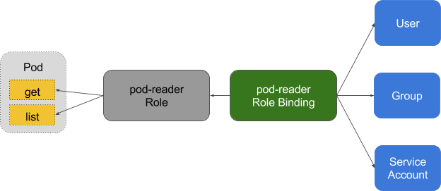

# RBAC 授權

Kubernetes 的基於角色的存取控制（Role-Based Access Control，RBAC）透過角色定義權限，再用綁定將權限授予使用者、組或服務賬號。權限按規則累加，RBAC 不提供拒絕規則。應只授予主體完成工作所需的權限。

## 前言

RBAC API 使用 `rbac.authorization.k8s.io/v1`。歷史上，該 API 在 Kubernetes 1.6 進入 beta，並在 1.8 成為穩定版。設定 API Server 時，將 RBAC 加入授權器鏈；可以使用 `--authorization-mode=...,RBAC`，也可以使用 `--authorization-config` 設定檔案。詳見[官方 RBAC 文件](https://kubernetes.io/docs/reference/access-authn-authz/rbac/)。

## RBAC 與 ABAC

鑑權決定使用者是否可以使用 Kubernetes API 執行某項操作。授權適用於 kubectl 等客戶端，也適用於叢集內透過 Kubernetes API 操作叢集的應用。

RBAC 策略由 Kubernetes API 物件管理，適合透過 Role、ClusterRole 及其綁定授予權限。下文的 ABAC 遷移範例僅記錄舊叢集行為，不是當前設定指南，切勿照搬。

對於新部署和權限管理，應使用 RBAC 並按最小權限原則設定。有關授權機制的當前說明，請參閱 [Kubernetes 授權文件](https://kubernetes.io/docs/reference/access-authn-authz/authorization/)。

## 基礎概念

需要理解 RBAC 一些基礎的概念和思路，RBAC 是讓使用者能夠存取 [Kubernetes API 資源](https://kubernetes.io/docs/reference/) 的授權方式。


在 RBAC 中定義了兩個物件，用於描述在使用者和資源之間的連線權限。

### Role 與 ClusterRole

Role（角色）是一系列權限的集合，例如一個角色可以包含讀取 Pod 的權限和列出 Pod 的權限。Role 只能用來給某個特定 namespace 中的資源作鑑權，對多 namespace 和叢集級的資源或者是非資源類的 API（如 `/healthz`）使用 ClusterRole。

```yaml
# Role 示例
kind: Role
apiVersion: rbac.authorization.k8s.io/v1
metadata:
  namespace: default
  name: pod-reader
rules:
- apiGroups: [""] #"" indicates the core API group
  resources: ["pods"]
  verbs: ["get", "watch", "list"]
```

```yaml
# ClusterRole 示例
kind: ClusterRole
apiVersion: rbac.authorization.k8s.io/v1
metadata:
  # "namespace" omitted since ClusterRoles are not namespaced
  name: secret-reader
rules:
- apiGroups: [""]
  resources: ["secrets"]
  verbs: ["get", "watch", "list"]
```

### RoleBinding 和 ClusterRoleBinding

RoleBinding 把角色（Role 或 ClusterRole）的權限對映到使用者或者使用者組，從而讓這些使用者繼承角色在 namespace 中的權限。ClusterRoleBinding 讓使用者繼承 ClusterRole 在整個叢集中的權限。

ServiceAccount 的使用者名稱格式為 `system:serviceaccount:<namespace>:<name>`。某個命名空間內所有 ServiceAccount 都屬於 `system:serviceaccounts:<namespace>` 組；所有命名空間的 ServiceAccount 都屬於 `system:serviceaccounts` 組。

```yaml
# RoleBinding 示例（引用 Role）
# This role binding allows "jane" to read pods in the "default" namespace.
kind: RoleBinding
apiVersion: rbac.authorization.k8s.io/v1
metadata:
  name: read-pods
  namespace: default
subjects:
- kind: User
  name: jane
  apiGroup: rbac.authorization.k8s.io
roleRef:
  kind: Role
  name: pod-reader
  apiGroup: rbac.authorization.k8s.io
```



```yaml
# RoleBinding 示例（引用 ClusterRole）
# This role binding allows "dave" to read secrets in the "development" namespace.
kind: RoleBinding
apiVersion: rbac.authorization.k8s.io/v1
metadata:
  name: read-secrets
  namespace: development # This only grants permissions within the "development" namespace.
subjects:
- kind: User
  name: dave
  apiGroup: rbac.authorization.k8s.io
roleRef:
  kind: ClusterRole
  name: secret-reader
  apiGroup: rbac.authorization.k8s.io
```

### ClusterRole 聚合

從 v1.9 開始，在 ClusterRole 中可以透過 `aggregationRule` 來與其他 ClusterRole 聚合使用（該特性在 v1.11 GA）。

比如

```yaml
kind: ClusterRole
apiVersion: rbac.authorization.k8s.io/v1
metadata:
  name: monitoring
aggregationRule:
  clusterRoleSelectors:
  - matchLabels:
      rbac.example.com/aggregate-to-monitoring: "true"
rules: [] # Rules are automatically filled in by the controller manager.
---
kind: ClusterRole
apiVersion: rbac.authorization.k8s.io/v1
metadata:
  name: monitoring-endpoints
  labels:
    rbac.example.com/aggregate-to-monitoring: "true"
# These rules will be added to the "monitoring" role.
rules:
- apiGroups: [""]
  resources: ["services", "endpoints", "pods"]
  verbs: ["get", "list", "watch"]
```

### 預設 ClusterRole

API Server 會建立一組預設 ClusterRole 和 ClusterRoleBinding。名稱以 `system:` 開頭的角色由叢集控制平面管理，不應隨意修改。角色的具體清單隨 Kubernetes 版本變化，參見[預設角色和綁定](https://kubernetes.io/docs/reference/access-authn-authz/rbac/#default-roles-and-role-bindings)。

## 舊版權限行為

舊 ABAC 及過度寬泛的 `cluster-admin` 綁定範例不適用於目前的權限管理；舊的可執行命令已移至[封存範例](https://github.com/fun-ed/kubernetes-handbook/blob/main/archive/zh-TW/extension/auth/rbac.md)，不要在叢集執行。新設定應採用 RBAC 並遵循最小權限原則。

## 推薦設定

* 針對命名空間內的資源，使用 Role 和 RoleBinding。
* 針對叢集級資源，或需要跨所有命名空間授權時，使用 ClusterRole 和 ClusterRoleBinding。
* 針對多個指定命名空間中的資源，可以使用 ClusterRole 和各命名空間中的 RoleBinding。

## 開源工具

* [liggitt/audit2rbac](https://github.com/liggitt/audit2rbac)
* [reactiveops/rbac-manager](https://github.com/reactiveops/rbac-manager)
* [jtblin/kube2iam](https://github.com/jtblin/kube2iam)

## 參考文件

* [認證](https://kubernetes.io/docs/reference/access-authn-authz/authentication/)
* [授權](https://kubernetes.io/docs/reference/access-authn-authz/authorization/)
* [RBAC 授權](https://kubernetes.io/docs/reference/access-authn-authz/rbac/)
* [RBAC 最佳實踐](https://kubernetes.io/docs/concepts/security/rbac-good-practices/)
* [ServiceAccount](https://kubernetes.io/docs/concepts/security/service-accounts/)
