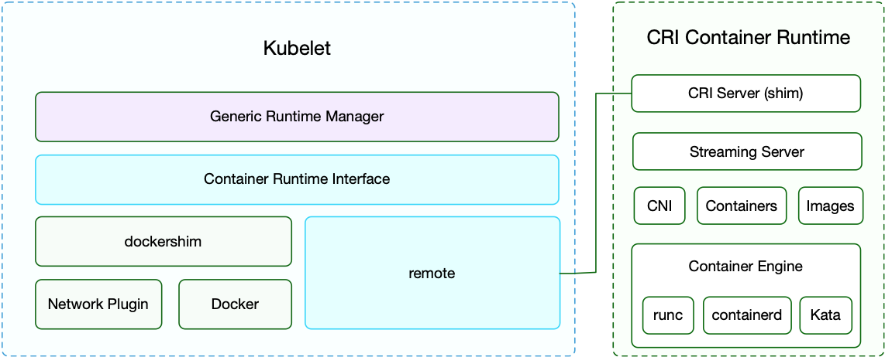

# 執行時外掛 CRI

容器執行時外掛（Container Runtime Interface，簡稱 CRI）是 Kubernetes v1.5 引入的容器執行時介面，它將 Kubelet 與容器執行時解耦，將原來完全面向 Pod 級別的內部介面拆分成面向 Sandbox 和 Container 的 gRPC 介面，並將映像檔管理和容器管理分離到不同的服務。

## Kubernetes v1.37.1 當前執行時

Kubernetes v1.37.1 只接受 CRI v1。Kubernetes 1.26 起不再連線只實現 `v1alpha2` 的執行時；容器執行時若不支援 CRI v1，kubelet 無法註冊為 Node。選擇執行時之前，還要檢視該執行時自己的釋出和發行版支援矩陣。

| 執行時 | 2026-10-05 穩定版本 | Kubernetes v1.37.1 的證據 |
| :--- | :--- | :--- |
| [containerd](https://github.com/containerd/containerd/releases/tag/v2.4.1) | v2.4.1（2026-09-24） | Kubernetes 要求 CRI v1；本書未找到 containerd v2.4.1 對 Kubernetes v1.37 的官方相容矩陣。 |
| [CRI-O](https://github.com/cri-o/cri-o/releases/tag/v1.37.2) | v1.37.2（2026-10-02） | CRI-O 官方安裝儲存庫按 Kubernetes 次版本釋出流配套，使用 v1.37 Kubernetes 時選擇 CRI-O v1.37 流。 |

Kubernetes 不再內建 dockershim。Docker Engine 需要獨立的 CRI 配接器，例如 `cri-dockerd`；它與 Docker Engine 分開發布和支援。

### containerd 2.4.1

containerd 包含 CRI 外掛。生成對應版本預設設定後，確認 CRI 外掛沒有禁用，並讓 containerd 與 kubelet 使用相同 cgroup 驅動。systemd 主機推薦 `systemd`。下面是 containerd v2 的設定版本 3 語法：

```toml
version = 3

[plugins.'io.containerd.cri.v1.runtime'.containerd.runtimes.runc.options]
  SystemdCgroup = true

[plugins.'io.containerd.cri.v1.images'.pinned_images]
  sandbox = 'registry.k8s.io/pause:3.10.2'
```

CRI socket 為 `unix:///run/containerd/containerd.sock`。設定變更後重啟 containerd。二進位包安裝、CNI 外掛安裝和其他設定項見 [containerd v2.4.1 安裝說明](https://github.com/containerd/containerd/blob/v2.4.1/docs/getting-started.md) 與 [CRI 外掛設定說明](https://github.com/containerd/containerd/blob/v2.4.1/docs/cri/config.md)。

### CRI-O 1.37.2

CRI-O 的穩定套件釋出流與 Kubernetes 次版本對應。用於 Kubernetes v1.37 時使用 CRI-O v1.37 套件流。CRI-O 預設使用 systemd cgroup manager；以下顯式設定範例可放入 `/etc/crio/crio.conf.d/02-runtime.conf`：

```toml
[crio.runtime]
cgroup_manager = "systemd"

[crio.image]
pause_image = "registry.k8s.io/pause:3.10.2"
```

CRI-O 的 CRI socket 為 `unix:///var/run/crio/crio.sock`。設定變更後重啟 CRI-O。按發行版安裝儲存庫和套件的步驟見 [CRI-O 官方打包說明](https://github.com/cri-o/packaging#usage)。

CRI socket 必須與 kubelet 的 `--container-runtime-endpoint` 一致。使用 kubeadm 時，在 `InitConfiguration.nodeRegistration.criSocket` 指定節點執行時 socket。用 `crictl info` 檢查 CRI 服務，再按 [crictl 指南](cri-tools.md)診斷節點。

> 以下 CRI v1alpha2 程式碼、dockershim、Frakti、rktlet 和 cri-containerd 歷史版本表只用於理解介面沿革，不是 Kubernetes v1.37.1 的執行時選擇或設定指南。


CRI 最早從從 1.4 版就開始設計討論和開發，在 v1.5 中釋出第一個測試版。在 v1.6 時已經有了很多外部容器執行時，如 frakti 和 cri-o 等。v1.7 中又新增了 cri-containerd 支援用 Containerd 來管理容器。

採用 CRI 後，Kubelet 的架構如下圖所示：



> 舊 CRI v1alpha2 程式碼、dockershim、舊 kubelet flags 與已停止維護的 runtime 範例已封存；目前部署請使用本頁上方 CRI v1 設定。見[封存材料](https://github.com/fun-ed/kubernetes-handbook/blob/main/archive/zh-TW/extension/cri/README.md)。

## RuntimeClass

RuntimeClass 是內建的叢集級 API 物件，用來選擇一個已在容器執行時設定的 handler。它不需要 CRD，也不需要啟用特性門控。Kubernetes v1.37 使用 `node.k8s.io/v1`，`handler` 是 RuntimeClass 的頂層欄位，必須與執行時設定名稱一致。

```yaml
apiVersion: node.k8s.io/v1
kind: RuntimeClass
metadata:
  name: kata
handler: kata
```

在 Pod 中透過 `runtimeClassName` 選擇該 handler：

```yaml
apiVersion: v1
kind: Pod
metadata:
  name: isolated-workload
spec:
  runtimeClassName: kata
  containers:
  - name: app
    image: registry.k8s.io/pause:3.10.2
```

有關替代 runtime handler 的容器執行時設定，請參閱 [containerd CRI 設定文件](https://github.com/containerd/containerd/blob/v2.4.1/docs/cri/config.md)和所選執行時專案的 Kubernetes 支援說明。

## 參考文件

* [Runtime Class Documentation](https://kubernetes.io/docs/concepts/containers/runtime-class/#runtime-class)
* [Sandbox Isolation Level Decision](https://docs.google.com/document/d/1fe7lQUjYKR0cijRmSbH_y0_l3CYPkwtQa5ViywuNo8Q/preview)
