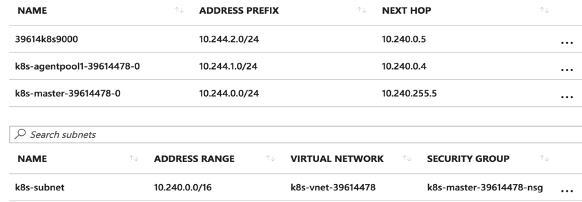

# 網路外掛

## 網路模型

* IP-per-Pod，每個 Pod 都擁有一個獨立 IP 位址，Pod 內所有容器共享一個網路命名空間
* 叢集內所有 Pod 都在一個直接連通的扁平網路中，可透過 IP 直接存取
  * 所有容器之間無需 NAT 就可以直接互相存取
  * 所有 Node 和所有容器之間無需 NAT 就可以直接互相存取
  * 容器自己看到的 IP 跟其他容器看到的一樣
* Service ClusterIP 僅供叢集內存取；外部請求可透過 NodePort、LoadBalancer 或 Gateway/Ingress 暴露

## 網路外掛和版本（2026-10-05）

Kubernetes 不提供一個可通用於所有叢集的預設 Pod 網路實現。每個叢集必須設定一個符合 CNI 要求的網路實現。選定並安裝一種主 CNI；不要把多個互不相容的 CNI 當作並列安裝步驟。CNI 外掛二進位包不是完整的多節點 Kubernetes 網路方案，須按網路實現的部署說明設定 IPAM、路由、策略和執行時。

| 網路實現或元件 | 穩定版本 | Kubernetes v1.37.1 相容性證據 |
| :--- | :--- | :--- |
| [Cilium](https://github.com/cilium/cilium/releases/tag/v1.20.2) | v1.20.2（2026-09-16） | Cilium v1.20 官方矩陣只保證 Kubernetes 1.33–1.36；未列出 v1.37。 |
| [Calico](https://github.com/projectcalico/calico/releases/tag/v3.33.0) | v3.33.0（2026-10-01） | 官方測試 Kubernetes 1.35、1.36 和 1.37。 |
| [Flannel](https://github.com/flannel-io/flannel/releases/tag/v0.28.9) | v0.28.9（2026-08-07） | 未找到該版本針對 v1.37 的官方相容矩陣；不可據此宣稱受支援。 |
| [OVN-Kubernetes](https://github.com/ovn-kubernetes/ovn-kubernetes/releases/tag/v1.4.0) | v1.4.0（2026-09-04） | 釋出說明提到 Kubernetes v1.36.2；未找到 v1.37 相容宣告。 |
| [CNI plugins](https://github.com/containernetworking/plugins/releases/tag/v1.9.1) | v1.9.1（2026-03-16） | Kubernetes v1.37.1 原始碼依賴清單固定此版本；它是 CNI 外掛二進位包，不是完整叢集網路。 |
| [SR-IOV Network Operator](https://github.com/k8snetworkplumbingwg/sriov-network-operator/releases/tag/v1.6.0) | v1.6.0（2025-08-13） | 釋出說明提到 OpenShift 4.18；未宣告支援 Kubernetes v1.37.1。它是硬體/裝置運營元件，不是通用主 CNI。 |

安裝前應檢查網路實現的相容矩陣、核心和平台前提，並確認 Pod CIDR、Service CIDR、節點網路和防火牆規則互不衝突。具體的版本化安裝命令見 [Cilium](cilium.md)、[Calico](calico.md) 和 [Flannel](flannel.md)。

## 歷史網路外掛介面

下文的 kubenet 和 exec 外掛文字用於解釋舊叢集的實現背景，不代表 Kubernetes v1.37.1 的通用預設值或可用的安裝方式。exec 網路外掛介面早已移除。當前叢集應按發行版文件設定 CNI。

* CNI（Container Network Interface）是執行時與網路外掛之間的介面和設定格式；它本身不是一種網路實現。
* kubenet 是歷史上的一種簡單網路實現，是否提供以及如何設定取決於 Kubernetes 發行版。不要把它寫成通用推薦預設值。
* exec：Kubernetes 已移除的舊 kubelet 網路外掛介面。需要擴充套件網路時使用 CNI 實現。


## kubenet（歷史實現）
> 本節保留舊版 kubenet 工作方式說明，不是 Kubernetes v1.37.1 的安裝方法。


kubenet 是一個基於 CNI bridge 的網路外掛，它為每個容器建立一對 veth pair 並連線到 cbr0 網橋上。kubenet 在 bridge 外掛的基礎上拓展了很多功能，包括

* 使用 host-local IPAM 外掛為容器分配 IP 位址， 並定期釋放已分配但未使用的 IP 位址
* 設定 sysctl `net.bridge.bridge-nf-call-iptables = 1`
* 為 Pod IP 建立 SNAT 規則
  * `-A POSTROUTING ! -d 10.0.0.0/8 -m comment --comment "kubenet: SNAT for outbound traffic from cluster" -m addrtype ! --dst-type LOCAL -j MASQUERADE`
* 開啟網橋的 hairpin 和 promisc 模式，允許 Pod 存取它自己所在的 Service IP（即透過 NAT 後再存取 Pod 自己）

  ```bash
  -A OUTPUT -j KUBE-DEDUP
  -A KUBE-DEDUP -p IPv4 -s a:58:a:f4:2:1 -o veth+ --ip-src 10.244.2.1 -j ACCEPT
  -A KUBE-DEDUP -p IPv4 -s a:58:a:f4:2:1 -o veth+ --ip-src 10.244.2.0/24 -j DROP
  ```

* HostPort 管理以及設定連接埠映射
* Traffic shaping，支援透過 `kubernetes.io/ingress-bandwidth` 和 `kubernetes.io/egress-bandwidth` 等 Annotation 設定 Pod 網路頻寬限制

下圖是一個 Kubernetes on Azure 多節點的 Pod 之間相互通訊的原理：


跨節點 Pod 之間相互通訊時，會透過雲平台或者交換機設定的路由轉發到正確的節點中：



未來 kubenet 外掛會遷移到標準的 CNI 外掛（如 ptp），具體計劃見 [這裡](https://docs.google.com/document/d/1glJLMHrE2eqwRrAN4fdsz4Vg3R1Iqt6bm5GJQ4GdjlQ/edit#)。

## CNI bridge 範例（歷史本地實驗）

> 本節的 bridge 設定演示單機 CNI 行為，不是適用於 Kubernetes 叢集的完整網路方案。舊儲存庫位址已退役，CNI 0.3.0 範例也不是 Kubernetes v1.37.1 的安裝設定。當前 CNI 二進位版本見上表；請按你選定的 CNI 專案文件安裝和設定。

更多 CNI 網路外掛介面和本地實驗細節見 [CNI 網路外掛](cni.md)。

## [Flannel](flannel.md)

[Flannel](https://github.com/flannel-io/flannel) 是使用 overlay 或主機路由為 Pod 提供連通性的 CNI 實現。2026-10-05 的穩定版本為 [v0.28.9](https://github.com/flannel-io/flannel/releases/tag/v0.28.9)。本書未找到官方針對 Kubernetes v1.37 的相容矩陣；安裝前核對上游釋出說明和叢集前提。按 [Flannel 版本化指南](flannel.md)安裝，不要使用 `master` 清單。

## Weave Net 歷史架構

Weave Net 曾使用 Gossip 控制平面和 UDP overlay。上游儲存庫已歸檔，舊 Kubernetes 安裝端點與清單不能用於當前叢集。歷史技術細節見[歸檔索引](https://github.com/fun-ed/kubernetes-handbook/blob/main/archive/index.md)。

## [Calico](calico.md)

Calico 是 CNI 網路實現，也提供網路策略功能。2026-10-05 的穩定版本為 [v3.33.0](https://github.com/projectcalico/calico/releases/tag/v3.33.0)。官方要求說明此版本測試 Kubernetes 1.35、1.36 和 1.37。按 [Calico 版本化指南](calico.md)安裝；不要使用舊版本清單。


## [OVN Kubernetes](ovn-kubernetes.md)
> OVN-Kubernetes v1.4.0 釋出說明提到 Kubernetes v1.36.2，但沒有驗證 v1.37.1 的相容性宣告。見[固定版本的架構和歷史範例](ovn-kubernetes.md)。


[OVN (Open Virtual Network)](https://www.ovn.org/en/) 是 OVS 提供的原生虛擬化網路方案，旨在解決傳統 SDN 架構（比如 Neutron DVR）的效能問題。

OVN 為 Kubernetes 提供了兩種網路方案：

* Overaly: 透過 ovs overlay 連線容器
* Underlay: 將 VM 內的容器連到 VM 所在的相同網路（開發中）

其中，容器網路的設定是透過 OVN 的 CNI 外掛來實現。

## Contiv 歷史架構

Contiv 曾提供多租戶容器網路與策略管理。上游儲存庫已歸檔，舊安裝步驟不能用於當前叢集。歷史技術細節見[歸檔索引](https://github.com/fun-ed/kubernetes-handbook/blob/main/archive/index.md)。

## Romana

> 歷史架構簡介；本書未核實可用於 Kubernetes v1.37.1 的當前發行版或相容矩陣。

Romana 是 Panic Networks 在 2016 年提出的開源專案，旨在借鑑 route aggregation 的思路來解決 Overlay 方案給網路帶來的開銷。

## OpenContrail / Contrail

Juniper/Contrail 提供網路虛擬化控制器和 vRouter。上游 release 頁面沒有可確認的帶日期穩定版本，且本書未找到 Kubernetes v1.37 相容矩陣；生命週期狀態未證實，不能據此稱其已退役。舊 Kubernetes 整合依賴已移除的 exec network plugin，不適用於當前叢集。見[上游釋出資訊](https://github.com/Juniper/contrail-controller/releases)。

## Midonet

> 歷史 OpenStack 網路架構簡介，不是 Kubernetes v1.37.1 的 CNI 部署指南。

Midonet 曾由 Zookeeper 和 Cassandra 儲存 VPC 資源狀態，並將控制器分佈到轉發裝置。其資料不應直接套用到當前 Kubernetes 叢集。

## Host network

最簡單的網路模型就是讓容器共享 Host 的 network namespace，使用宿主機的網路協議棧。這樣，不需要額外的設定，容器就可以共享宿主的各種網路資源。

優點

* 簡單，不需要任何額外設定
* 高效，沒有 NAT 等額外的開銷

缺點

* 沒有任何的網路隔離
* 容器和 Host 的連接埠號容易衝突
* 容器內任何網路設定都會影響整個宿主機

> 注意：HostNetwork 只讓 Pod 使用宿主機的網路命名空間，不會代替叢集 Pod 網路。節點仍需要由發行版提供或安裝一個主 CNI；Kubernetes v1.37.1 不會預設設定 kubenet。

## 其他

### ipvs（歷史模式）

Kubernetes v1.8 起支援過 ipvs kube-proxy 模式。當前 IPVS 模式已棄用；nftables kube-proxy 模式已 GA，但不是預設值。選擇並設定服務代理模式時，按 v1.37 文件核對核心前提；不要照搬下面的舊版 alpha 說明。

### [Canal](https://github.com/tigera/canal)

Canal 組合 Calico 網路策略和 Flannel 網路實現。該舊簡介未記錄與 Kubernetes v1.37.1 匹配的 Canal 發行版及相容矩陣；如使用，應確認供應方明確支援所選 Flannel 和 Calico 版本，不要把它當作額外主 CNI 疊加安裝。

### Kuryr-Kubernetes（已退役）

> OpenStack Kuryr-Kubernetes 的 [2024.1-eom 釋出](https://github.com/openstack/kuryr-kubernetes/releases/tag/2024.1-eom)明確標記專案為 **RETIRED**（2025-10-31）。不要用於新叢集；舊教程與設定見[歸檔索引](https://github.com/fun-ed/kubernetes-handbook/blob/main/archive/index.md)。

### [Cilium](https://github.com/cilium/cilium)

Cilium 是基於 eBPF 和 XDP 的網路實現，提供 CNI 和網路策略功能。截至 2026-10-05，其穩定版為 [v1.20.2](https://github.com/cilium/cilium/releases/tag/v1.20.2)；[v1.20 官方矩陣](https://docs.cilium.io/en/v1.20/network/kubernetes/compatibility/)只保證 Kubernetes 1.33–1.36，沒有列出 v1.37。安裝見[Cilium 當前指南](cilium.md)，不要使用舊教程的 `HEAD` 清單或歷史部署步驟。

### kope

> 歷史路由專案簡介；本書未核實 Kubernetes v1.37.1 支援狀態或當前安裝指南。

### [Kube-router](https://github.com/cloudnativelabs/kube-router)

[Kube-router](https://github.com/cloudnativelabs/kube-router) 是一個基於 BGP 的網路外掛，並提供了可選的 ipvs 服務發現（替代 kube-proxy）以及網路策略功能。

> **歷史安裝說明（不可執行）**：本頁舊例使用 `master` 清單、刪除 kube-proxy DaemonSet 和 Docker Engine 命令，均不是當前 Kubernetes v1.37.1 的安全部署步驟。本書未確認 Kube-router 的當前穩定版本或 v1.37 相容性；不要執行舊命令，須先查專案發行說明和支援矩陣。

Cilium 的 BGP 控制平面與 IPv6 路由情境另見 [Cilium BGP 與 IPv6](cilium-bgp-ipv6.md)。若使用 nftables kube-proxy 模式，請參閱 [nftables 專章](../../network/nftables.md)；模式相容性取決於叢集環境與版本，不應套用為預設值。
