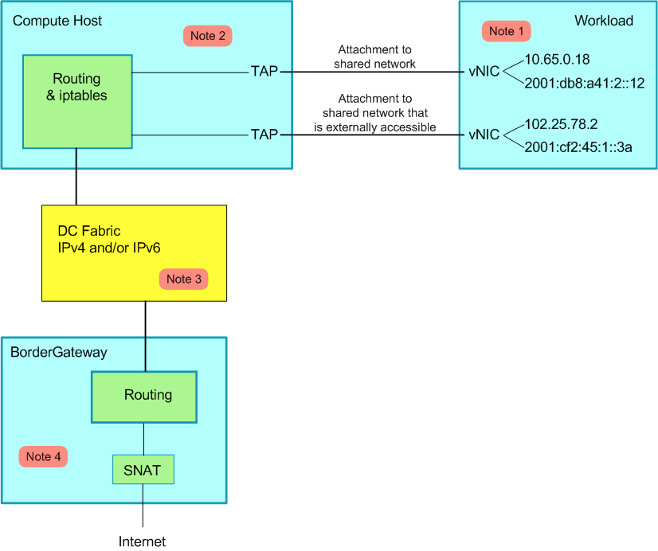

# Calico

[Calico](https://www.projectcalico.org/) 是一個純三層的資料中心網路方案（不需要 Overlay），並且與 OpenStack、Kubernetes、AWS、GCE 等 IaaS 和容器平台都有良好的整合。

Calico 在每一個計算節點利用 Linux Kernel 實現了一個高效的 vRouter 來負責資料轉發，而每個 vRouter 透過 BGP 協議負責把自己上執行的 workload 的路由資訊像整個 Calico 網路內傳播——小規模部署可以直接互聯，大規模下可透過指定的 BGP route reflector 來完成。 這樣保證最終所有的 workload 之間的資料流量都是透過 IP 路由的方式完成互聯的。Calico 節點組網可以直接利用資料中心的網路結構（無論是 L2 或者 L3），不需要額外的 NAT，隧道或者 Overlay Network。

此外，Calico 基於 iptables 還提供了豐富而靈活的網路 Policy，保證透過各個節點上的 ACLs 來提供 Workload 的多租戶隔離、安全組以及其他可達性限制等功能。

## 當前 Kubernetes 安裝（2026-10-05）

Calico v3.33.0 是截至 2026-10-05 的穩定版本。官方支援矩陣明確列出 Kubernetes 1.35、1.36 和 1.37，節點還需要 Linux kernel 5.10 或更高版本。為 Kubernetes 1.37 安裝時，先設定與叢集一致且不重疊的 Pod CIDR，再執行 Calico 3.33.0 的版本化 CRD、Tigera Operator 和自定義資源清單：

```bash
kubectl create -f https://raw.githubusercontent.com/projectcalico/calico/v3.33.0/manifests/v3_projectcalico_org.yaml
kubectl create -f https://raw.githubusercontent.com/projectcalico/calico/v3.33.0/manifests/tigera-operator.yaml
kubectl create -f https://raw.githubusercontent.com/projectcalico/calico/v3.33.0/manifests/custom-resources.yaml
```

預設自定義資源清單使用 `192.168.0.0/16`。如果建立叢集時選了其他 Pod CIDR，先編輯對應的 `Installation` 自定義資源，不要照搬預設 CIDR。叢集只能選擇一個主 CNI；不要把 Calico 和另一種不相容的網路實現並裝。

來源：[Calico v3.33.0 release](https://github.com/projectcalico/calico/releases/tag/v3.33.0)、[Kubernetes 安裝要求和相容矩陣](https://docs.tigera.io/calico/latest/getting-started/kubernetes/requirements)、[Calico 安裝指南](https://docs.tigera.io/calico/latest/getting-started/kubernetes/quickstart)。

> 以下 Calico 架構、etcd、Docker CNM、舊 CNI 設定和 `v3.1`/`v3.0` 命令是歷史教學材料，不要用於當前 Kubernetes 安裝。


## Calico 架構


Calico 主要由 Felix、etcd、BGP client 以及 BGP Route Reflector 組成

1. Felix，Calico Agent，跑在每臺需要執行 Workload 的節點上，主要負責設定路由及 ACLs 等資訊來確保 Endpoint 的連通狀態；
2. etcd，分散式鍵值儲存，主要負責網路後設資料一致性，確保 Calico 網路狀態的準確性；
3. BGP Client（BIRD）, 主要負責把 Felix 寫入 Kernel 的路由資訊分發到當前 Calico 網路，確保 Workload 間的通訊的有效性；
4. BGP Route Reflector（BIRD），大規模部署時使用，摒棄所有節點互聯的 mesh 模式，透過一個或者多個 BGP Route Reflector 來完成集中式的路由分發。
5. calico/calico-ipam，主要用作 Kubernetes 的 CNI 外掛



## IP-in-IP

Calico 控制平面的設計要求物理網路得是 L2 Fabric，這樣 vRouter 間都是直接可達的，路由不需要把物理裝置當做下一跳。為了支援 L3 Fabric，Calico 推出了 IPinIP 的選項。

## Calico CNI

見 [https://github.com/projectcalico/cni-plugin](https://github.com/projectcalico/cni-plugin)。

## Calico CNM

Calico 透過 Pool 和 Profile 的方式實現了 docker CNM 網路：

1. Pool，定義可用於 Docker Network 的 IP 資源範圍，比如：10.0.0.0/8 或者 192.168.0.0/16；
2. Profile，定義 Docker Network Policy 的集合，由 tags 和 rules 組成；每個 Profile 預設擁有一個和 Profile 名字相同的 Tag，每個 Profile 可以有多個 Tag，以 List 形式儲存。

具體實現見 [https://github.com/projectcalico/libnetwork-plugin](https://github.com/projectcalico/libnetwork-plugin)。

> 舊 etcd/Docker 整合、`v3.1` manifest、停用 TLS 驗證的 kubeconfig 及舊程序輸出已封存；目前安裝步驟見上方 Calico v3.33.0 指南。見[封存原始材料](https://github.com/fun-ed/kubernetes-handbook/blob/main/archive/zh-TW/extension/network/calico.md)。

**參考文件**

* [https://xuxinkun.github.io/2016/07/22/cni-cnm/](https://xuxinkun.github.io/2016/07/22/cni-cnm/)
* [https://www.projectcalico.org/](https://www.projectcalico.org/)
* [http://blog.dataman-inc.com/shurenyun-docker-133/](http://blog.dataman-inc.com/shurenyun-docker-133/)
