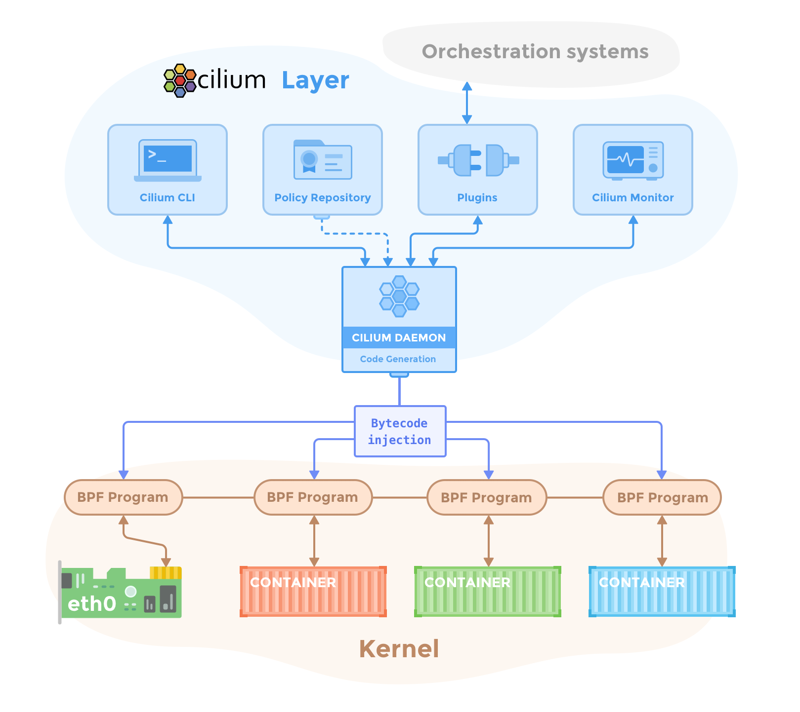

# Cilium

[Cilium ](https://github.com/cilium/cilium)是一個基於 eBPF 和 XDP 的高效能容器網路方案，程式碼開源在 [https://github.com/cilium/cilium](https://github.com/cilium/cilium)。其主要功能特性包括

* 安全上，支援 L3/L4/L7 安全策略，這些策略按照使用方法又可以分為
  * 基於身分的安全策略（security identity）
  * 基於 CIDR 的安全策略
  * 基於標籤的安全策略
* 網路上，支援三層平面網路（flat layer 3 network），如
  * 覆蓋網路（Overlay），包括 VXLAN 和 Geneve 等
  * Linux 路由網路，包括原生的 Linux 路由和雲服務商的高階網路路由等
* 提供基於 BPF 的負載平衡
* 提供便利的監控和排錯能力



## 當前安裝（2026-10-05）

Cilium v1.20.2 是截至 2026-10-05 的最新穩定版本，其 Helm chart 版本與 Cilium 版本一致。官方相容矩陣只列 Kubernetes 1.33–1.36，未列出本書基線 v1.37.1，因此不能據此認定兩者相容。以下命令僅適用於已確認位於官方相容範圍內的叢集，不是 Kubernetes v1.37.1 部署指引。官方安裝文件要求設定 Kubernetes CNI 網路，並要求 Linux kernel 5.10 或更新版本。安裝前確認叢集沒有另一個不相容的主 CNI。

```bash
helm repo add cilium https://helm.cilium.io/
helm repo update
helm install cilium cilium/cilium \
  --version 1.20.2 \
  --namespace kube-system
```

其策略範例使用 Cilium CRD 的 `cilium.io/v2` API；不能僅憑 CRD API 版本推斷控制器與 Kubernetes 的相容性。

來源：[Cilium v1.20.2 release](https://github.com/cilium/cilium/releases/tag/v1.20.2)、[Cilium v1.20 Kubernetes 相容矩陣](https://docs.cilium.io/en/v1.20/network/kubernetes/compatibility/)、[Cilium v1.20 Helm 安裝指南](https://docs.cilium.io/en/v1.20/installation/k8s-install-helm/)。

若要深入瞭解 Cilium 的 BGP 控制平面與 IPv6 路由情境，請參閱 [Cilium BGP 與 IPv6](cilium-bgp-ipv6.md)；本頁版本相容性限制仍適用。

[eBPF](https://docs.cilium.io/en/v1.20/reference-guides/bpf/) 和 XDP 背景介紹如下。


## eBPF 和 XDP

eBPF（extended Berkeley Packet Filter）起源於BPF，它提供了核心的資料包過濾機制。BPF的基本思想是對使用者提供兩種SOCKET選項：`SO_ATTACH_FILTER`和`SO_ATTACH_BPF`，允許使用者在sokcet上新增自定義的filter，只有滿足該filter指定條件的資料包才會上發到使用者空間。`SO_ATTACH_FILTER`插入的是cBPF程式碼，`SO_ATTACH_BPF`插入的是eBPF程式碼。eBPF是對cBPF的增強，目前使用者端的tcpdump等程式還是用的cBPF版本，其載入到核心中後會被核心自動的轉變為eBPF。Linux 3.15 開始引入 eBPF。其擴充了 BPF 的功能，豐富了指令集。它在核心提供了一個虛擬機器，使用者態將過濾規則以虛擬機器指令的形式傳遞到核心，由核心根據這些指令來過濾網路資料包。


XDP（eXpress Data Path）為Linux核心提供了高效能、可程式設計的網路資料路徑。由於網路包在還未進入網路協議棧之前就處理，它給Linux網路帶來了巨大的效能提升。XDP 看起來跟 DPDK 比較像，但它比 DPDK 有更多的優點，如

* 無需第三方程式碼庫和許可
* 同時支援輪詢式和中斷式網路
* 無需分配大頁
* 無需專用的CPU
* 無需定義新的安全網路模型

當然，XDP的效能提升是有代價的，它犧牲了通用型和公平性：（1）不提供快取佇列（qdisc），TX裝置太慢時直接丟包，因而不要在RX比TX快的裝置上使用XDP；（2）XDP程式是專用的，不具備網路協議棧的通用性。

## 歷史部署材料

> 本節原有部署步驟使用 Cilium 1.0、Kubernetes 1.10、`HEAD` 清單、etcd 和 cluster-admin ServiceAccount 綁定。它們不適用於當前叢集，不能安全地透過只替換 URL 或 API 版本升級。請使用本頁上方固定為 Cilium v1.20.2 的 Helm 命令，並檢查上游相容矩陣。

舊教程中的 Minikube 和 Istio 步驟不再保留為可複製命令。策略範例仍在下方，使用 `cilium.io/v2` 自定義資源。


## 安全策略

TCP 策略：

```yaml
apiVersion: "cilium.io/v2"
kind: CiliumNetworkPolicy
description: "L3-L4 policy to restrict deathstar access to empire ships only"
metadata:
  name: "rule1"
spec:
  endpointSelector:
    matchLabels:
      org: empire
      class: deathstar
  ingress:
  - fromEndpoints:
    - matchLabels:
        org: empire
    toPorts:
    - ports:
      - port: "80"
        protocol: TCP
```

CIDR 策略

```yaml
apiVersion: "cilium.io/v2"
kind: CiliumNetworkPolicy
metadata:
  name: "cidr-rule"
spec:
  endpointSelector:
    matchLabels:
      app: myService
  egress:
  - toCIDR:
    - 20.1.1.1/32
  - toCIDRSet:
    - cidr: 10.0.0.0/8
      except:
      - 10.96.0.0/12
```

L7 HTTP 策略：

```bash
apiVersion: "cilium.io/v2"
kind: CiliumNetworkPolicy
description: "L7 policy to restrict access to specific HTTP call"
metadata:
  name: "rule1"
spec:
  endpointSelector:
    matchLabels:
      org: empire
      class: deathstar
  ingress:
  - fromEndpoints:
    - matchLabels:
        org: empire
    toPorts:
    - ports:
      - port: "80"
        protocol: TCP
      rules:
        http:
        - method: "POST"
          path: "/v1/request-landing"
```

## 歷史監控工具

舊的 `microscope` 專案和其可變 `master` manifest 沒有經過 Cilium v1.20 或 Kubernetes v1.37.1 驗證；安裝命令不再提供。診斷當前 Cilium 流量時，可使用與部署版本匹配的 `cilium monitor` CLI。

## 參考資料

* [Cilium documentation](http://cilium.readthedocs.io/)
