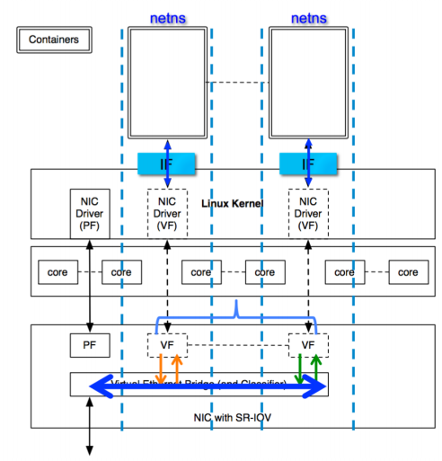

# SR-IOV

> **Kubernetes v1.37 相容性未驗證。** 截至 2026-10-05，當前 SR-IOV Network Operator 穩定釋出為 [v1.6.0](https://github.com/k8snetworkplumbingwg/sriov-network-operator/releases/tag/v1.6.0)（2025-08-13）；其釋出說明提到 OpenShift 4.18，但沒有宣告支援 Kubernetes v1.37.1。Operator、SR-IOV CNI 和硬體/驅動有各自的版本與前提；不要把本頁舊 Intel/Docker 範例當作當前安裝方法。


SR-IOV 技術是一種基於硬體的虛擬化解決方案，可提高效能和可伸縮性

> SR-IOV 標準允許在虛擬機器之間高效共享 PCIe（Peripheral Component Interconnect Express，快速外設元件互連）裝置，並且它是在硬體中實現的，可以獲得能夠與本機效能媲美的 I/O 效能。SR-IOV 規範定義了新的標準，根據該標準，建立的新裝置可允許將虛擬機器直接連線到 I/O 裝置（SR-IOV 規範由 PCI-SIG 在 [http://www.pcisig.com](http://www.pcisig.com) 上進行定義和維護）。單個 I/O 資源可由許多虛擬機器共享。共享的裝置將提供專用的資源，並且還使用共享的通用資源。這樣，每個虛擬機器都可存取唯一的資源。因此，啟用了 SR-IOV 並且具有適當的硬體和 OS 支援的 PCIe 裝置（例如乙太網連接埠）可以顯示為多個單獨的物理裝置，每個都具有自己的 PCIe 設定空間。

SR-IOV主要用於虛擬化中，當然也可以用於容器。



## 歷史主機設定範例（不可直接執行）

```bash
modprobe ixgbevf
lspci -Dvmm|grep -B 1 -A 4 Ethernet
echo 2 > /sys/bus/pci/devices/0000:82:00.0/sriov_numvfs
# check ifconfig -a. You should see a number of new interfaces created, starting with “eth”, e.g. eth4
```

## 歷史 Docker SR-IOV 外掛

Intel給docker寫了一個SR-IOV network plugin，原始碼位於[https://github.com/clearcontainers/sriov](https://github.com/clearcontainers/sriov)，同時支援runc和clearcontainer。

## 歷史 CNI 外掛實現

Intel維護了一個SR-IOV的[CNI外掛](https://github.com/Intel-Corp/sriov-cni)，fork自[hustcat/sriov-cni](https://github.com/hustcat/sriov-cni)，並擴充套件了DPDK的支援。

專案主頁見[https://github.com/Intel-Corp/sriov-cni](https://github.com/Intel-Corp/sriov-cni)。

## 優點

* 效能好
* 不佔用計算資源

## 缺點

* VF數量有限
* 硬體綁定，不支援容器遷移

**參考文件**

* [http://blog.scottlowe.org/2009/12/02/what-is-sr-iov/](http://blog.scottlowe.org/2009/12/02/what-is-sr-iov/)
* [https://github.com/clearcontainers/sriov](https://github.com/clearcontainers/sriov)
* [https://software.intel.com/en-us/articles/single-root-inputoutput-virtualization-sr-iov-with-linux-containers](https://software.intel.com/en-us/articles/single-root-inputoutput-virtualization-sr-iov-with-linux-containers)
* [http://jason.digitalinertia.net/exposing-docker-containers-with-sr-iov/](http://jason.digitalinertia.net/exposing-docker-containers-with-sr-iov/)
