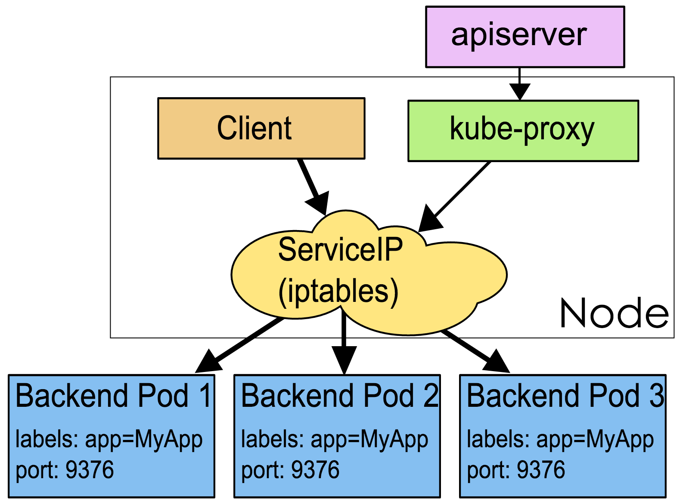

# Kubernetes 基本概念

## Container

Container（容器）是一種行動式、輕量級的作業系統級虛擬化技術。它使用 namespace 隔離不同的軟體執行環境，並透過映像檔自包含軟體的執行環境，從而使得容器可以很方便的在任何地方執行。

由於容器體積小且啟動快，因此可以在每個容器映像檔中打包一個應用程式。這種一對一的應用映像檔關係擁有很多好處。使用容器，不需要與外部的基礎架構環境綁定, 因為每一個應用程式都不需要外部依賴，更不需要與外部的基礎架構環境依賴。完美解決了從開發到生產環境的一致性問題。

容器同樣比虛擬機器更加透明，這有助於監測和管理。尤其是容器程序的生命週期由基礎設施管理，而不是被程序管理器隱藏在容器內部。最後，每個應用程式用容器封裝，管理容器部署就等同於管理應用程式部署。

其他容器的優點還包括

* 敏捷的應用程式建立和部署: 與虛擬機器映像檔相比，容器映像檔更易用、更高效。
* 持續開發、整合和部署: 提供可靠與頻繁的容器映像檔建置、部署和快速簡便的回復（映像檔是不可變的）。
* 開發與運維的關注分離: 在建置/釋出時即建立容器映像檔，從而將應用與基礎架構分離。
* 開發、測試與生產環境的一致性: 在膝上型電腦上執行和雲中一樣。
* 可觀測：不僅顯示作業系統的資訊和度量，還顯示應用自身的資訊和度量。
* 雲和作業系統的分發可移植性: 可執行在 Ubuntu, RHEL, CoreOS, 物理機, GKE 以及其他任何地方。
* 以應用為中心的管理: 從傳統的硬體上部署作業系統提升到作業系統中部署應用程式。
* 松耦合、分散式、彈性伸縮、微服務: 應用程式被分成更小，更獨立的模組，並可以動態管理和部署 - 而不是執行在專用裝置上的大型單體程式。
* 資源隔離：可預測的應用程式效能。
* 資源利用：高效率和高密度。

## Pod

Kubernetes 使用 Pod 來管理容器，每個 Pod 可以包含一個或多個緊密關聯的容器。

Pod 是一組緊密關聯的容器，也是 Kubernetes 排程的基本單位。Pod 內容器共享網路與 IPC 命名空間；檔案不會自動共享，需透過 Pod 卷掛載到各容器。


在 Kubernetes 中，所有物件都使用 manifest（yaml 或 json）來定義，比如一個簡單的 nginx 服務可以定義為 nginx.yaml，它包含一個映像檔為 nginx 的容器：

```yaml
apiVersion: v1
kind: Pod
metadata:
  name: nginx
  labels:
    app: nginx
spec:
  containers:
  - name: nginx
    image: nginx:1.30.5
    ports:
    - containerPort: 80
```

## Node

Node 是 Pod 實際執行的主機，可以是實體機或虛擬機器。每個 Node 都需要 kubelet 和符合 CRI 的容器執行時。kube-proxy 通常負責實作 Service 網路，但部分網路實作會取代它。


## Namespace

Namespace 是對一組資源和物件的抽象集合，比如可以用來將系統內部的物件劃分為不同的專案組或使用者組。常見的 pods, services, replication controllers 和 deployments 等都是屬於某一個 namespace 的（預設是 default），而 node, persistentVolumes 等則不屬於任何 namespace。

## Service

Service 是應用服務的抽象，透過標籤選取器關聯後端 Pod。控制平面以 EndpointSlice 發布後端端點；kube-proxy 或相容的替代實作據此轉送 Service 流量。舊 Endpoints API 自 Kubernetes v1.33 起棄用，新工具應使用 EndpointSlices。

一般 ClusterIP Service 會取得叢集內虛擬 IP，並由叢集 DNS 提供服務名稱。Headless Service 不會配置 ClusterIP；實際服務探索和流量轉送方式取決於 Service 類型及叢集網路實作。



```yaml
apiVersion: v1
kind: Service
metadata:
  name: nginx
spec:
  ports:
  - port: 8078 # the port that this service should serve on
    name: http
    # the container on each pod to connect to, can be a name
    # (e.g. 'www') or a number (e.g. 80)
    targetPort: 80
    protocol: TCP
  selector:
    app: nginx
```

## Label

Label 是識別 Kubernetes 物件的標籤，以 key/value 的方式附加到物件上（key 最長不能超過 63 位元組，value 可以為空，也可以是不超過 253 位元組的字串）。

Label 不提供唯一性，並且實際上經常是很多物件（如 Pods）都使用相同的 label 來標誌具體的應用。

Label 定義好後其他物件可以使用 Label Selector 來選擇一組相同 label 的物件（比如 ReplicaSet 和 Service 用 label 來選擇一組 Pod）。Label Selector 支援以下幾種方式：

* 等式，如 `app=nginx` 和 `env!=production`
* 集合，如 `env in (production, qa)`
* 多個 label（它們之間是 AND 關係），如 `app=nginx,env=test`

## Annotations

Annotations 是 key/value 形式附加於物件的註解。不同於 Labels 用於標誌和選擇物件，Annotations 則是用來記錄一些附加資訊，用來輔助應用部署、安全策略以及排程策略等。比如 deployment 使用 annotations 來記錄 rolling update 的狀態。
